+++
title = "The windiest 135km bike ride"
date = "2022-04-17T08:10:57-04:00"

#
# description is optional
#
description = "A sub-epic tale of pedalling and wind gusts."

tags = ["bikes",]
+++

This is the tale of my longest bike ride to date, a 135km slog through rail trails and dirt roads from our house to the in-lawses place for Easter weekend. There are no particularly high or low points, so please temper your expectations now. Mostly it's a bit of a travelog for myself; making note of what worked, what didn't and where do we go from here.

### Prelude

The pandemic era (early 2020 and ongoing) has been hard on everyone. In early 2021 I burnt out and needed to take over a month away from work to recover. It took months before I was getting back into decent physical and mental condition and I still feel like I'm not quite 100%.

During that timespan, everyone's horizons seem to have shrunk considerably. Gatherings that used to be common have become anxiety-inducing affairs where everyone needs to weigh the risk of  infection versus benefits of a community. For someone who struggled with gatherings to begin with, the world becomes daunting as we move toward whatever normal will become. So I needed a project where I could focus some energy and would hopefully provide a mental and physical boost even by making the attempt.

Just before the start of the pandemic, I picked up a 2019 Devinci Hatchet (57cm frame for a ~6'1" rider, if you care) that had been used as a shop demo, so was able to get quite a deal on it. The bike was quickly named Grimey after a character from [the best Simpsons episode ever](https://frinkiac.com/episode/S08E23/11661).

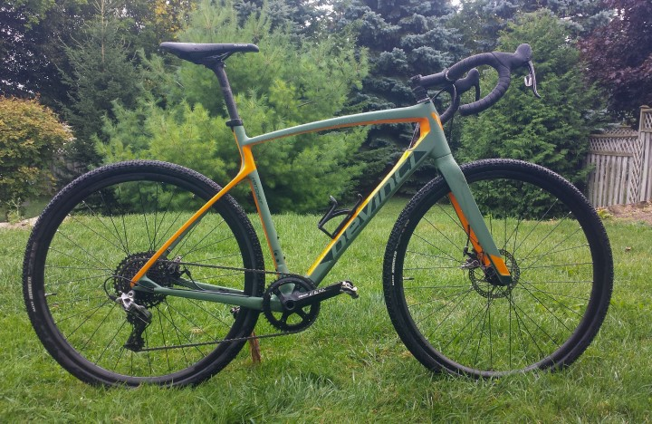

This bike really opened up *shoulder-season* training for me. Mountain biking is a wonderful pursuit, but the trails aren't open until mid-April and then are crummy again for a good portion of October and November (Canadian monsoon season).

### Wellness Skrillas!

Last September I started a contract at my current place of employment that provided an ample boost in "Wellness Bucks" (not the real name, but way better than the real name). Pondering what sort of crap would be most beneficial to my well-being, obviously "new bike shit" was the only real thought to cross my mind. So I did some research and pored over bike-gear review sites and picked up a nice jacket, some winter-weight bib tights and some rain-proof booties so I could be out in the rain without my feet being frozen. For anyone who hasn't ridden in the rain with soggy feet, there is no better way to hate cycling.

I also picked up some seemingly-overpriced-but-amazing-quality bags from [Apidura](https://www.apidura.com). Along with a couple of water bottle mounts, these allowed me to ditch a backpack and maximize comfort out on the bike.

### Inception

For years now I've been considering making the trek to my partner's Parents' place via bicycle. At 125km by car it's a "big enough" distance without being a "ridiculous" distance for a pretty green distance rider like myself. I've done hundreds of 2-hour mountain bike rides, but generally nothing more involved than that, and usually never much more than 10km from the car park.

The confluence of events during the pandemic led me to believe that this might be a decent idea to add a bit of pep-in-my-step and a feather in my cap. To maybe make me start to believe that I can accomplish things and that the world isn't terrifying. Correction: the world is terrifying, but maybe I have the mental fortitude to put up with it, maybe even thrive. So sometime during the winter of 2021-2022, the old cranium slowly focused in on "Easter weekend" as the time to make the attempt.

### Training, plotting

Not much endurance training was actually undertaken during the winter. Like pretty much everyone, I hate training during the winter and indoors. I tried to use the rowing machine over the winter coupled with some weight training using our adjustable dumbbells and a TRX setup. Occasionally I would jump on the spin bike for an hour or so and watch an episode of *Call My Agent* while hating it. The biking. *Call My Agent* is a good way to brush up on French skills.

Things were able to ramp up a bit in March when the trails were starting to thaw out and were mostly muddy rather than icey. I was able to fire off a nice self-portrait on the first bigger ride of the year with a thick fog covering.. ..well, everything.

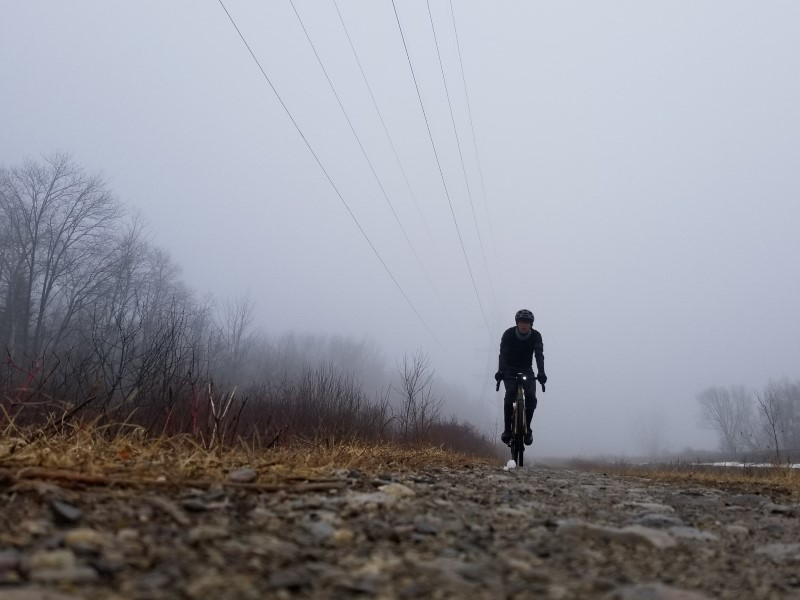

From there the rides generally got longer and longer, with the exception of hills days. There was only one hills days, but they are really good for increasing cardio capacity (or so I tell myself). I live on the edge of a ridge with some fairly steep sides. It seems like a [drumlin](https://nsidc.org/cryosphere/glaciers/gallery/drumlins.html) but I've never actually looked into that. But there are some decently steep roads in the neighbourhood, so I set out with the sole intention of doing ten hill climbs. Think of high-intensity intervals except where the intervals are defined by going uphill as hard as you can. It only took 40 minutes, but was probably more out of gas than following 2 x 2hr training rides.

Training rides were typically pretty gentle since the plan was to go farther than harder. Trying to keep the heart rate around 130-140 bpm (68-74% MHR) and going for about 2 hours at a time, twice a day getting closer to go-time. This roughly correlates with "moderate intensity" physical activity for anyone keeping track at home. This seemed like a decent "could do this all day if necessary" pace once you get used to it.

### Let's talk jams

A lot of time in the saddle staring straight ahead means a lot of time with headphones crammed into my earholes absorbing sounds. [Quick aside: I didn't want to get stuck with out-of-juice wireless headphones, so I used [some super-good-value wired headphones](https://www.amazon.ca/dp/B00UH35KH8)]. I don't listen to podcasts because I haven't found any that I don't find boring. My brain is also hypervigilant 74% of the time (100% - [80% of sleeping time]) so it's a nice break to just be able to see some nice countryside and listen to music I've already heard a billion times. There's a playlist on my phone called "grinding" and it just gets played on random. Since everyone has different tastes in music, I'll just list out a few of the various things on there. I like having a mix of everything from "really mellow/wimpy" to "fast, loud and yelly".

#### Really Mellow/Wimpy

- **The Juliana Theory:** Emo band, they have some really good not-super-wimpy songs ([*If I told you this was killing me*](https://www.youtube.com/watch?v=pO_rw83woKc)) but songs like [*August in Bethany*](https://www.youtube.com/watch?v=Jw1KNSuDj1Q) are just what the doctor ordered when you need to just keep pedalling and feel like you're never going to make it.

- **Dashboard Confessional:** Possibly the whiniest and emoest music out there, it's also fantastic for just zoning out, singing along. I guess when I see it written down it's almost meditative. So that's good, makes the miles tick by. Try [*The Brilliant Dance*](https://www.youtube.com/watch?v=sxrTzuIc2H8) I guess.

#### Middle Ground

- **Anberlin:** No idea why this isn't the most popular band in the world. Go listen to [*Stationary Stationery*](https://www.youtube.com/watch?v=LeVeKammF0s) or [*Cold War Transmissions*](https://www.youtube.com/watch?v=J2TxQ7oc054). You probably won't like them, but at least you'll know.

- **Saves the Day:** Poppy emo band. Whiny with a weird hint of teenage angst. I guess [*Shoulder to the Wheel*](https://www.youtube.com/watch?v=f5eOwgzJmV0) is a good introductory song.

#### The fast and the yelly

These songs are all completely personal. While you're out riding at a comfortable pace, there is no real reason to listen to music like this unless it just makes you feel happy.

- **Much the Same:** A criminally-underrated melodic hardcore (read: punk) band. I recommend the entire album *Survive* and if I had to pick a single song, I don't know, [Stitches](https://www.youtube.com/watch?v=iIykLzlIHNw). But that's seriously just picking a song more or less randomly.

- Older **Comeback Kid:** There were two Comeback Kid albums I really liked, *Turn it Around* and *Wake the Dead*, with the latter being super good. If you need a quick pick-me-up and don't have any caffeinated anything around, throw on [*Wake the Dead*](https://www.youtube.com/watch?v=2NTyyCwwDfY) and problem solved!

### Variables

April weather in Canada is notoriously shaky, with very mild temperatures and snowstorms roughly equally likely. The week prior to the chosen day, the weather forecast was calling for cool temperatures (high of 6 °C) with chance of rain and it kept alternating between windy/maybe not windy.

Luckily, I am a sucker for a good marketing campaign and have been trained by my outdoorsy overlords to believe that there is "no such thing as bad weather, only unsuitable clothing". Which I agree with down to about 2 °C at which point even with woolen socks and state-of-the-art booties, my feet still slowly go numb over a span of a couple of hours and things are a lot less cozy all over. Since that was the expected overnight temperature the night prior to the ride, I was reluctantly still planning to make the attempt.

There was a "special weather statement" for the day before my ride, letting us know that there would be strong wind gusts, up to 70 km/h or some such speed. "Good", I said to myself, "let it blow itself out and leave behind a nice calm day for me!"

At this point, doubt had creeped in fairly strongly, as you may infer from my [previous blog post](/last-training-ride-before-the-big-ride/). Part of me still didn't believe I could do it. The catastrophizing came on thick and fast with at least 3 feasible scenarios playing out in my mind, but luckily they all had one thing in common: survivable. So we'll deal with them if we need to, not in brainland.

### Pistols at dawn

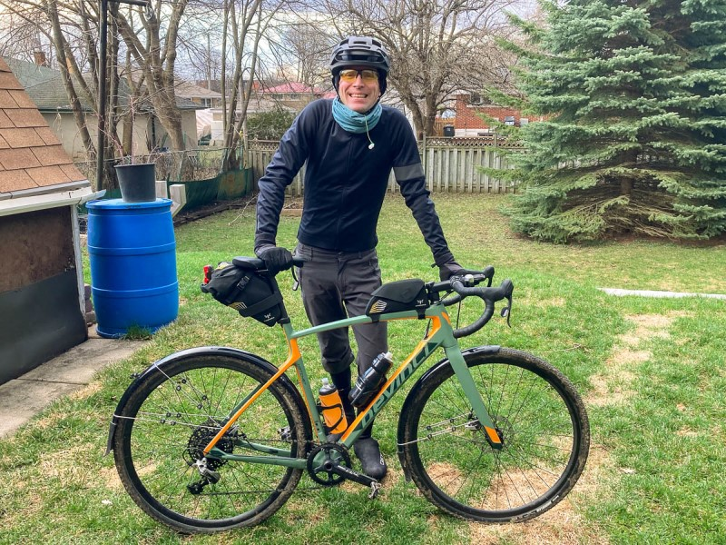

The day-of dawned cloudy and chilly, with patches of frost dotting the grass. The weather forecast looked pretty bad. Chance of rain in the afternoon and wind kicking up from the southwest, starting at 20 km/h gusting to 40 km/h and picking up steam to 30 km/h gusting to 70 km/h in the afternoon. To put these things in perspective, I like to imagine driving a car at gust speed and putting your hand out the window, palm facing the front to catch the most amount of wind. Shit. 70 km/h is a lot. And I mean, you know what's coming from the damn title.

Luckily I headed out just before 8am with the plan to start riding along a rail trail heading west-northwest, so should only be catching a slight headwind. A few snowflakes drifted lazily through the air on my way out of town.

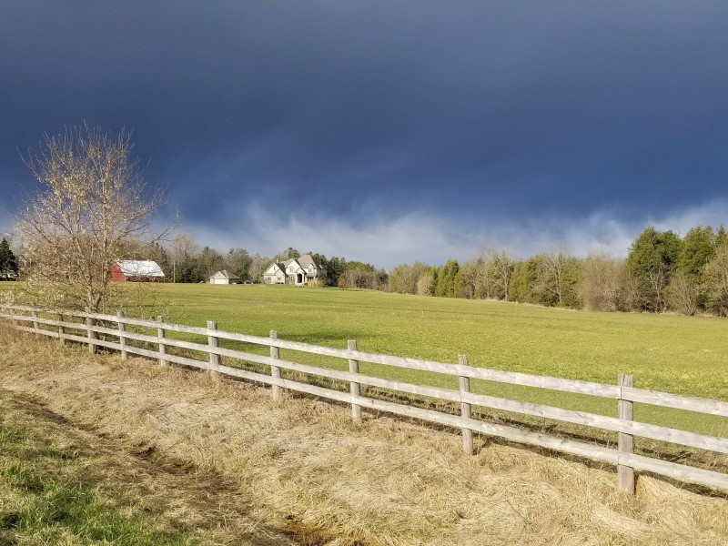

The first hint of the suck-assness to come came around 32km in at the 1h45min mark where the trail takes a band to the west-southwest. Which was basically straight into the wind, which is recorded as being about 30km/h sustained at a nearby weather station around that time. That stretch only lasted about half an hour and 8km and it was still early on in the ride, so we sucked it up and kept pedalling.

### I can program my watch, how's that for nerd-cred

With another chunk of wellness-money, I picked up a [Bangle2js](https://www.espruino.com/Bangle.js2) hackable smartwatch. I haven't put a ton of time into monkeying with it yet, but since I am a doubtful person, I figured that we should add some positive-affirmations to the watch face. I came up with a short list of off-the-cuff statements, fired together about twenty lines of javascript and voila: inspiration. Fun detail: check out the step counter, this photo is from post-ride.

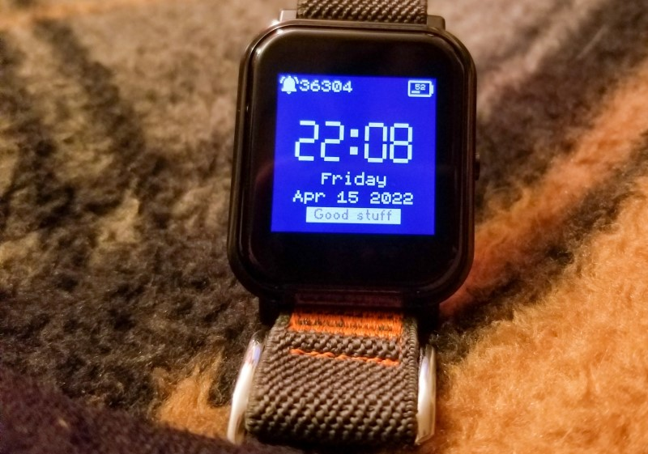

"Good Stuff" is probably the lamest of them unfortunately, and I think I got some pep from "you can do this!", "have fun?!" and "Keep pedalling". I forgot to add the cyclist classic "Shut up legs" but, well, I made it anyway.

And it turns out, "just keep pedalling" was a great mantra.

### Open farmland for miles in every direction

All shitty things must come to an end, and keep pedalling I did, making a right onto the first of a number of farm roads. The second leg of the journey was a bunch of jibbing and tacking across a grid of dirt roads through open farm country heading primarily to the northwest. The wind, as a reminder, is blowing from the southwest at this point. Which is 90° from my bearing, or directly sideways into me. At 30km/h plus gusts, which are unfortunately not listed in the historical record, but were probably *at least* 10km/h higher and probably more. At this point, I am moving forward a bit slower than usual, but *I am essentially a small piece of plywood* at the mercy of the winds. This required some actual technical riding skill, which is a far cry from the "nice-n-cruzy" rides that were the norm during training.

Picture it thusly: you're riding along, leaning into a 30 km/h steady wind coming from directly to your left. The dirt roads have a groove about a foot-and-a-half wide where all of the car (and buggy!) tires have gone, with loose gravel covering the rest of the surface. So you keep the contact points in the middle of this groove, no problem. But now the wind gusts and pushes you into the loose gravel, *and* you're now required to lean harder into the wind to keep from being completely swept into the ditch. So now you're leaning more and sliding out in the loose gravel and cursing your idiot self for not just pulling the phone out of your back pocket and calling for help.

But you can't. Because you can do this, at this point you *have* to do this. For no reason other than that you've started.

So this went on for about 25km, interspersed at the end of every segment with a few minutes of heading northeast for a few hundred meters until the next side road. And those few minutes are **glorious** and keep morale from flat-lining. With this strong, gusty wind firmly at my back, I watch my heart rate fall into the "reasonable" zone while maintaining 35 km/h with minimal effort and absolutely no headwind. It's an amazing feeling, but so fleeting. Also at one point I passed a mennonite church in-session and waved at all the horses in their little coats.

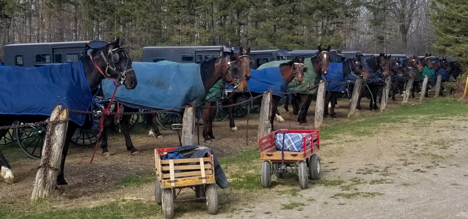

This segment ends in a small town, where a pit stop at the local donuttery provides a sugar boost and a top-up for the water bottles. This also marked roughly the halfway point of the trip, and it's now as easy to continue as to head back. I also knew that there was a fairly lengthy section coming up soon heading mostly north which should provide a nice tailwind.

### Full Send

A few more back roads and *gasp* some tarmac sections and we were onto what would probably be the start of some high-speed awesomeness to make up for the "I'm going to fall at any second" feelings I'd been plagued with for the past two hours. Which is a long time to expect to fall at any moment, and less fun than it sounds.

So we get to the road pointing north, and it's as great as expected. Minimal effort, even to climb hills, maintaining 30 km/h while still having a comparative rest. Finally that feeling of "I'm going to make it!"

Which is short-lived, of course. After twenty minutes, there are rocks blocking the road and signs saying this is private property and not to trespass. So I sit at the intersection with a stupid look on my face for a minute, then pull out my phone to figure out wtf. The next nearest roads travelling my direction will require some serious detouring, with at least part of that ride directly into the wind. Fuck it, says I, these signs must not take my particular conundrum into account. And I push on over the rocks, to grandmother's house we go.

This dirt lane is clearly someone's muddin' lane. Pondlike-puddles dot the route and even with a tailwind the going is slow and off-roading is required to keep from getting my nice booties coated in mud. Further along, a forest, complete with a number of blown-down trees. Surprisingly, they fell when the wind was coming from the opposite direction and thus were not casualties of today. However, it is a reminder of the vague danger of falling trees along forested trails on windy days. I'm wearing a helmet, I'll be fine.

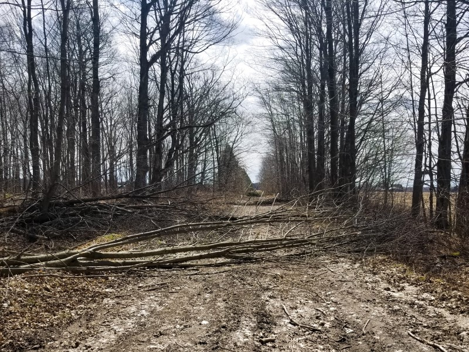

So after climbing over the trees and making my way a bit further along the dirt path, I make a nice discovery: I've been here before! I've made shorter rides along these routes in the past, and this is where I made my northward turn. I can do it, I've ridden from here before!

The trail opened up again, but the wind seems to have shifted slightly so it's now coming somewhat from my lefthand side. It's about a moot point, not really helping but not really slowing me down either. I can live with that.

### Three down, one to go

The last leg of the trip is a northwesterly jaunt along an old rail trail. Over 100km down and a little more than 30km to go. At this point though, the Clif bars and RealFruit gummies and bottle of Coke and fig bars and Mars bars are catching up with my poor stomach. I keep on eating something every half hour or forty-five minutes so I don't get the dreaded [bonk](https://www.bikeradar.com/advice/fitness-and-training/how-to-avoid-bonking-on-a-bike-ride/) ("that sudden, catastrophic loss of energy"). I'm definitely getting tired at this point, I noted that I was starting to feel tired at the 85km mark. Which is fine, I expected tired. So long as I can keep my energy levels up, I shouldn't get that shakey "I'm going to cry because I'm so tired" feeling. If you've had the feeling you know how desperately you want to avoid it.

Getting onto the rail trail was a little bit of a morale hit.

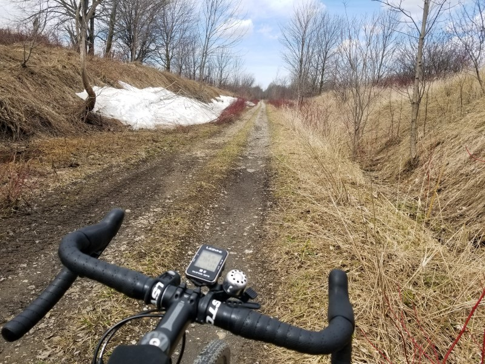
[Image caption: "Fuck."]

On the big version of the photo, you can see the odometer at 104km, and also a pile of snow still sitting at the side of a very gravelly trail. These trails are heavily travelled by ATVs and side-by-sides, all of whom think it is "rad" to chew up the trail until it is a washboardy mess. Flashbacks to the gravel road with the perfect crosswind and the relentless threat of being laying down a moment from now. By my clock I began this section at about 13:30, or 1:30pm for those of us who hate things being unambiguous. The historical record for a nearby weather station puts this entire last section at sustained winds of around 40km/h, and I know from looking at the conditions from the day-of that there were recorded gusts over 70km/h. From exactly at my left side. But well, I've made it this far dammit. You just have to stuff down all the doubts and the fatigue and just keep pedalling.

Luckily the washboard-gravel section only last for a few kilometers before giving way to a nicely maintained trail for the remainder of the trip. This made the relentless and gusting wind a bit more bearable, but this was definitely the part of the trip that was nothing but an unenjoyable slog. "I just want to get there, and lay down face down in the grass until I feel less like shit". Still not bonking, which is great, but the extra effort to counteract the wind and the fact that I was using an unexpectedly large amount of upper-body movements to stay upright has taken its toll.

### A solid slap in the face

As I got close to the destination, I knew there was a section about 3km long that would bring me from the trail, along a section of tarmac, to the destination. Honestly a pretty perfect set-up. So I got out on the tarmac, went into the drops (hands on bottom part of curly handlebars) and started gently cruising to the finish line. Until the forested section ended and I was suddenly in the middle of a violent windstorm which simultaneously almost brought me to a stop and blew me off the road. Not quite an exact headwind, just enough coming from the side to keep me off-balance for the final fight.

It was almost poetic, once I was able to catch my breath and think about it. When you're on easy street, you've started celebrating too soon and suddenly have to revert back to survival mode for one last spell. It took a lot to get through the last stretch. I stopped at the first intersection along that road and tried to decide if this is where I call an end to my journey, to ask for help to get the last 2km down the road. Even at rest the wind almost knocked me over. But again, I couldn't. My legs could still push against the pedals, so I threw my leg over the saddle, pushed my doubts aside and inched my way along that road.

### Welcoming Committee

Coming down that road at a glacial 10 km/h, tucked low on the drops and riding in the wrong lane to try to take advantage of the wind being launched over the road by the ditch, my girlfriend and her family had all come out the lane to celebrate this awful victory. I think I was semi-successful at pretending I was really happy to see everybody, but in that moment I just wanted to ride my bike behind the barn, lie face down and let out all the frustrations that had been building for the last six hours in a good solid cry.

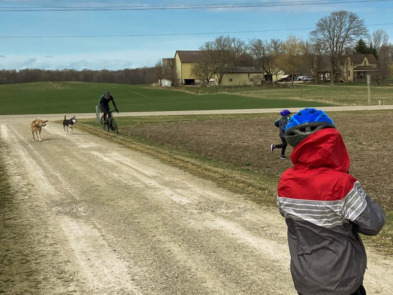

[Image caption: Literally blown off the driveway. A slog right to the finish line.]

I really do appreciate them coming out, but.. ..emotions are hard. After-the-fact I really wish I could have jumped up and down and cracked a beer right away and celebrated. But I just wasn't there.

I never did have that cry. The bike was laid down on its side and I just sat on the side of a hill with Ashley and her brother Scott while I tried to regain my composure. I laid down on my back for a bit, but suddenly got very dizzy and had to sit back up with my head between my knees. It passed and I was slowly able to come back to life.

I did it.

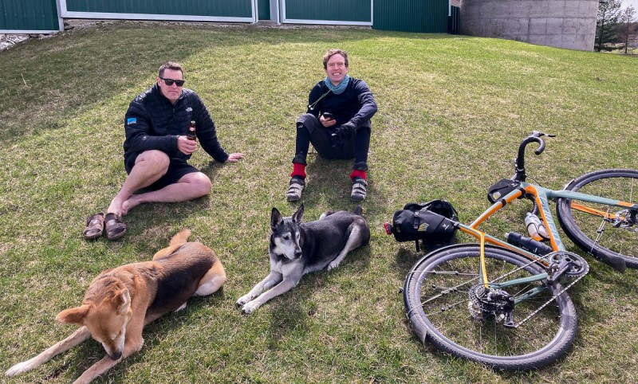

### Epilogue

The clock was started at 7:52am and the recorded distance was a touch over 135km. Moving time 6h44m with total elapsed time 7h20m. Average speed was a respectable 20.1 km/h.

I'm sure this whole trip would have been a lot less exciting and dramatic without the wind, but it definitely has turned this into a better story. I shit you not when I say this was a ridiculously windy day, here's a graphic I stole from *El Weather Netwerko* to sum up the day:

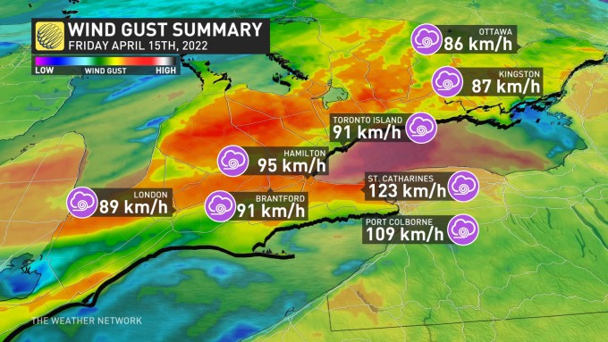

My ride took place in the general area of where the graphic for Hamilton is covering and into the red patch above it. So if anything I could possibly be *understating* the wind speed that day. Oh my.

Right after the ride we hung out and had a couple of beers and then some water. Aside from some slight exhaustion it was difficult to take a deep breath for a while, I wonder if the cold air irritated my lungs. The temperature maxxed out at 10 °C that day and was colder for much of the ride. The posture of being on a bike for that long isn't particularly good when you aren't adapted for it, and my wrists and deltoid muscles did some minor throbbing the rest of the day, but never enough to bother with taking any pain relievers.

After a couple of drinks, I fell asleep for an hour or so, and my stomach still had that gut-rot feeling and I ended up eating a pretty minimal dinner that night. Woke up for a bit and "just hung out", then back to bed around normal time, for a disappointingly-average sleep. However, I am known to wake up into panic attacks on occasion (it's as fun as it sounds) and had considered that it might happen considering the unknowns that had been dealt with that day. I can happily report that I woke up once in the night, calmly, and fell back asleep after somehow suppressing needing to take a whiz and not wanting to get up.

The next day I went for an easy 40-minute recovery ride in the relatively-so-calm local roads while listening to the album [Goodbye](https://www.youtube.com/watch?v=x2iGiFxr6D8) by Aurora Borealis. I definitely felt drained, but it was nice to get things moving since my knees were a bit sore on waking, along with a bit of soreness in my quads mostly, maybe a bit of glutes and hammies. Made me wonder what the experience would have been like in non-stupid conditions.

Our Easter lunch was possibly the greatest meal ever eaten. With a settled stomach and a backlog of calories to replenish, it's like the taste of everything was enhanced.

Und das, as they say, is alles. The bike came home on a rack. I marvelled at how easy and fast driving is. Perspective.