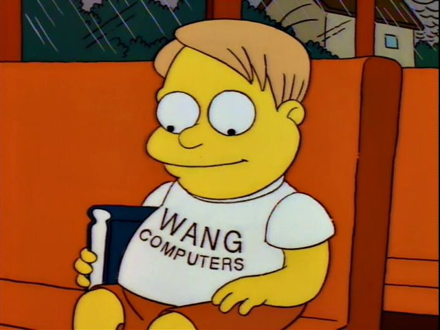

+++
title = "A few quick steps on a long jurney"
date = "2023-06-27T07:49:07-04:00"
draft = false
#
# description is optional
#
description = "How to go from meh to mediocre."

tags = ["coding", "education"]
+++

# I can code, just not well

In my experience, people generally try hard at what they do. There are definitely going to be exceptions to this, but most people will endeavour to show up every day and do something they can feel at least a little bit proud of. Being a people, I find myself in this category. For better or for worse.

# Let's keep this short

Like thousands of others before me, yesterday was my first performance review as a junior software developer. Despite many, many hours of study and practice and despite over a year of professional experience, I find myself firmly in the (*fucking*) Novice category.

Ugh.

Fair enough. As a consummate professional, I take constructive feedback in my stride. But this one hurts a bit. At this point I'm not entirely sure why, aside from the obvious fact that no one really likes to be told that they're less good than they
- think they are.
- would like to be.



# Next steps

I endeavour to become a proficient software developer, to the point where I may even use the word engineer self-referentially without irony. My next performance review is in three months and I really want to have made some vast strides sinces then.

So I'll use this to light a fire under my own ass and to improve. And hey, why not bl0g the journey so others might learn from my successes and failures. So hopefully I actually have a good reason to write and share posts and others can read along. 

"I can't believe it's not SEO garbage!"™

# Let me try something first

Just want to see if I have the capability to add code fences to this blog:

```go
package main

import (
    "fmt"
)

func main() {
    fmt.Println("Sup, nerds!")
}
```

oh yay I can! I thought I could. And I can `inline code snippets` too, I think? Oh good.

Alright, let's get it on.