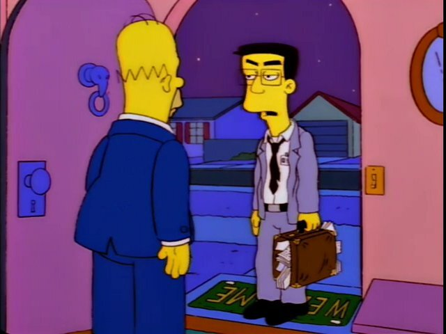

It's October! I'd been planning to ride 161km at some point this year and time was winding down, so this past Saturday was it. So I chucked some shit in my bike bags, chucked some albums onto a playlist and woke up early the Saturday of \[Canadian\] Thanksgiving weekend to see if I could do it.

  
[Grimey all loaded up! I had taken the fenders off at one point and luckily reinstalled them the night before the ride.]

#### First bit

The first bit was quite pleasant. The playlist started out with _Bleed American_ by Jimmy Eat World, an album I've listened to at least a thousand times before. It was nice cruising out of the neighbourhood at dawn, before anyone is out trying to hit me with their cars. I made it to the [Kissing Bridge Trail](http://www.kissingbridgetrailway.ca), an old rail trail near here, in just under half an hour. I've ridden along that stretch a bunch of times and this was about exactly the pace I was hoping for.

Scooted along the kissing bridge for not too many kilometers before it's time to break north and head toward Fergus along some country roads. The second album probably kicks in somewhere along here, Anberlin's _Lost Songs_ album. I really like most of their albums, this one was specfically chosen to remind me to calm the eff down. I have a tendency to push the pace and rush through things, needed a reminder that this is a marathon, not a sprint.

This part of the ride is nice and boring. These roads were part of a number of training rides so they're kinda boring, despite being a nice place to watch the sun rise.

#### Some hints of what's yet to come

Probably listening to Small Brown Bike's album _Our Own Wars_. This was a bit of an impulse addition to the playlist. This album has seen regular rotation over the years, but never super high up on the list. However, maybe because the band has bike in the title, I've always enjoyed this album. Maybe one you just need to be in the mood for.

After a pit stop at the local Tim Horton's for a double-chocolate doughnut, I'm on my way on the [Elora-Cataract Trailway](http://trailway.org) out of Fergus. Had a chat with an older fella on an electric tricyle, thinking how nice it is that technology can help people have the wind blow through their hair who may not do so otherwise. Wish him Happy Thanksgiving as I say goodbye and blast ahead of him. A few seconds pass before he must suddenly realize it's Thanksgiving weekend. "Happy Thanksgiving!" I hear in the distance.

Also the sun has retreated behind some clouds. A lot of clouds. Not theatening rain, but definitely letting me know the expected 60% chance of rain will probably yield fruit. Menacing clouds. I shake my fist at them and carry on.

[I couldn't tell from the internet whether or not this bridge was going to be passable, some things seemed yes and others seemed no. It turns out they were both right, depending on how you feel about climbing over stuff and trying to set your bike down gently from eight feet above the ground while wearing bike shoes.]

The album _Wake the Dead_ by the Comeback Kids comes and goes. It's a really great album if you like Hardcore. There's also [an amazing fan video](https://www.youtube.com/watch?v=6DFKjZ_vuBk) on youtube and it makes me really miss being young and idiot. There's some good singalongs here and I'm starting to get this impression this ride is going to fucking suck so the music helps a bit with morale.

At this point I'm headed north towards a [friend's](<https://trailerpark.fandom.com/wiki/We_Can%27t_Call_People_Without_Wings_Angels_So_We_Call_Them_Friends_(Episode)>) place near Kenilworth. Out in the middle of all the fields, a crosswind has picked up. There's a ton of [fetch](https://en.wikipedia.org/wiki/Wind_fetch) so the wind is sustained from the west, and I know that once I leave her place, there's about 50 kilometers of riding directly into it.

#### Let's get some apples! RUSSET APPLES!

As I cruise along enjoying _Something to Write Home About_ by The Get Up Kids, I get my first taste of riding directly west. It's a bit of a bummer because the wind is doing a number on the quality of the audio through my wired ear buds. Lots of wind noise, so a lot of the songs I'm only hearing by singing along with them. Noiselessly. So I am silently listening to this album in two different ways at once. It's a bit less than ideal, but I'm already trying to decide what I'm going to do.

I roll into our friend's place sometime after 10am around the 65km mark. Despite living in Canada for over twenty years, she is still super-British and drinking a spot of tea and wearing a Bletchley Park t-shirt.

She is a gracious hostess and takes me out to the RUSSET APPLE TREE to pick a few apples to help me on my way. So good! If you're not familiar with this variety, you need to seek them out and try them since they are absolutely the best variety. While I'm here I may as well get the egg mcmuffin I brought into me.

Taking stock, I'm feeling pretty good. 95 kilometers to go but I know that the next 50 are going to be a slog and that means knocking my speed down to like 15km/h and taking three stupid hours just to get two hours worth of far. It's a bit demoralizing.

But hell, we're here now and I've done a bunch of training so let's just suck it up and keep moving forwards.

Also I petted Clare's dogs and waved at her cows so that improved morale briefly.

[Bye cows, I love you!]

#### \*WIND SOUNDS\*

I was really excited to be listening to Ephilexia's album _Sun, Please, Explode_. It's math-rock and post-rock together! This means that it's instrumental and mellow but technically so. You just have to try it. Just set like an hour aside with some really good sound system and just [listen to it](https://inv.tux.pizza/watch?v=iEb8j-5IXAU). Maybe also smoke weed if that's what you do or enjoy a small two fingers of Northern Harvest Rye Whiskey if you're like me, and just be like "shit, he's right, this is awesome".

So heading straight into the wind for the indefinite future. Riding into the wind super-sucks ass because it takes a lot of effort to get nowhere.

It's hard to keep going for three or more straight hours directly into the stupid wind. Occasionally there would be a short stretch of a couple of kilometers where the road would be headed north or south, and it was much easier going. This is pretty much the only thing that kept me going. To know that it might eventually not be terrible.

[This is honestly the greatest moment of the whole ride. A single-lane gravel road, nobody around for miles *and* some sun!]

On the plus side, at some point Ephilexia faded into _Exile in Oblivion_ by Strung Out. It turns out I sing along with everything while I am biking. Not actually singing, just mouthing the words like a constant, silent karaoke. This was a great album for this point in the ride. High-energy and just good songs. I must have planned for a higher-energy section here, since the next two albums are Much the Same's _Everything is Fine_ and Face to Face's _Don't Turn Away_ (the first punk tape I ever bought). Both skate-punk, both just full of songs I've listened to dozens of times and super easy to digest. For me, these albums are like arrowroot cookies for my brain.

#### The hydrologic cycle

Somewhere during this sufferfest, as I was being chased (coincidentally) by a gang of amish in a horse-drawn cart, I could see those clouds in the distance with the swaths of rain hanging down. I'm gonna get wet. In retrospect, I should have put on some Andrew WK but life's not perfect.

The first rain wasn't too bad. About half an hour of on-and-off drizzle. Not enough to actually soak through. I start to wonder just how cold I'll be if I do indeed get soaked. I've got on a jacket and gloves but it's 12C out and windy and I'm not really set up to be soaking wet. _Tant pis_, nothing I can do about it anyway!

[The odometer has rolled over the 100km mark. Somewhere just north of Palmerston, Ontario.]

At some point I finally get to the goddam Malcolm Line, the start of my road north, wind from the side instead of front. It's so good. But I'm definitely getting tired. My arse hurts. My deltoids are sore. My wrists are sore.

I'm a whiny son of a bitch.

But onwards we march! Not because it was easy, but because we thought it would be easy. I got a good quote from a friend after I told him I went ahead with the ride and actually completed it:

> If the weather en route was anything like it is here, I'm truly sorry.

But life is good! We're headed north, there's a measly 50km left to go. I can do 50km on Grimeyback in my sleep. Oh, Grimey is my bike's name. I named him after Grimey from the Simpsons.

The music has toned it down a little bit and I got through Still Mountain's _Artemis_. A very mellow, gentle album. After this came Saosin's _Translating the Name EP_ which is like some sort of emo/screamo thing that I really enjoy. It's got some really awesome spastic drumming and is worth a listen.

[There's a [line from the Simpsons](https://inv.tux.pizza/watch?v=jlzEjXu6QGQ) that kept going through my head at this point: _"I just wish I was home with a big bag of potatuh chips. Mmm, potatuh chips."_ The odometer is at 121km maybe?]

On the way up Malcolm Line it rained twice more for ten or so minutes at a time. The final great landmark was getting to the rail trail which would take me from near Clifford all the way to my final destination. Super satisfying! I'm going to make it!

#### Epic conditions for an epic ride

Within about 5 minutes of getting on this trail the heavens decided it was time to test my tenacity and just really open up. Not torrential, but downpour for sure. And for good measure, the maintenance on the first half of the rail trail was sub-par and was basically just a trillion puddles linked together. So it was bumpy and wet. Fender helped _a lot_, but they don't protect from water coming down from above.

[No more photos from the last couple of hours since it was cold out and also raining and my gloves were thoroughly soaked and if I took them off they'd never go back on and my fingies would get cold.]

I figured by this point on the ride my brain would be a white paste and so threw some more post-rock on there. The eponymous \[self-titled\] album by _Transatlantic Alliance_. There's this one track on this album that stands out to me called _Stay Inside_. It's got a sample of an interview with a (possibly homeless) gentleman about how his life has just been a pile of shit and he just wants things to be better and he's doing his best and life just sucks. Of course I know that I've had things way better than this guy, but I feel like it sands down some rough edges. To hear this guy who's had a really rough life just wishing it was better.

So it's weird to feel like the finish line is in sight and still have a couple of hours ahead of you, and knowing your going to have to get through it soaking effing wet.

But a glimmer of hope: Mildmay, Ontario. They've got a gas station and I shimmy in there and grab myself a bottle of Brand-name cola beverage! I've got an hour left, this can carry me across that finish line, rain be damned!

[Editor's note: I definitely got some looks during that stop.]

I ration the cola beverage over the next hour. A good swig every fifteen minutes. Keep my energy up and something to break up the last segments. The last album to come on is _Stay What You Are_ by Saves the Day, another old emo record from the early noughts. Another album I can just mumble along with.

#### Then it was just done

Kept plowing along, finally there were ten km left, then five. Then the farm was in sight. The last five km or so I put it into cooldown mode, put it into an easier gear and just spin the legs out.

And then along the last stretch the odometer pulls across the 161km and I've done it!

I don't know what I expected. A feeling of elation. Some sort of connection with a higher power. The other problems in my life melting away and having no more significance because I did something challenging and achieved what I set out to do. I overcame adversity!

Instead, some cars flew past me and the odometer eventually ticked to 162km and on I went. It was only a couple more to the farm anyway.

I pulled into the driveway and Ashley asked if I wanted the dogs out. I said "nah thanks" because it was still all wet and rainy and they'd just get all wet and muddy. I rode my bike into the milkhouse, took off the gloves that I previously couldn't because if they got cold they'd never get warm again, and removed my shoe covers.

I hadn't had any emergency candy, so I ate some candy. Then I left the milkhouse, and walked into the house to get warm.
