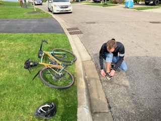
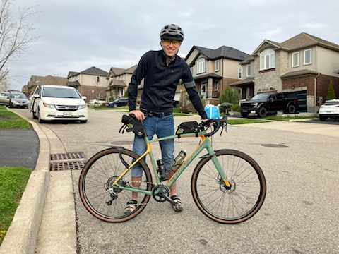
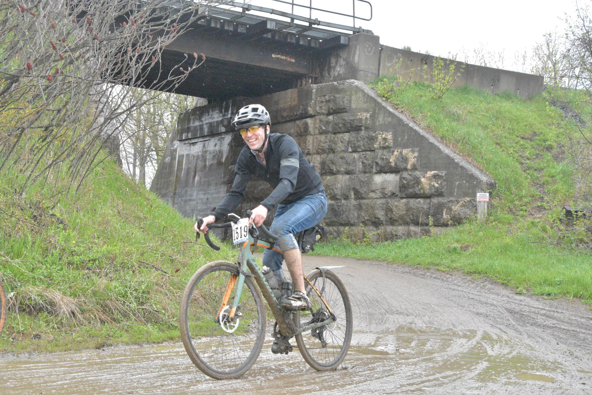
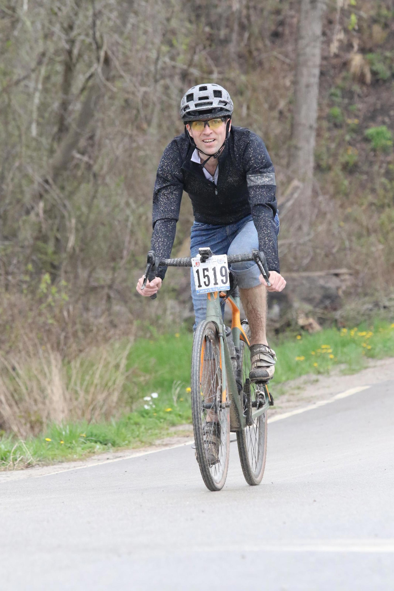
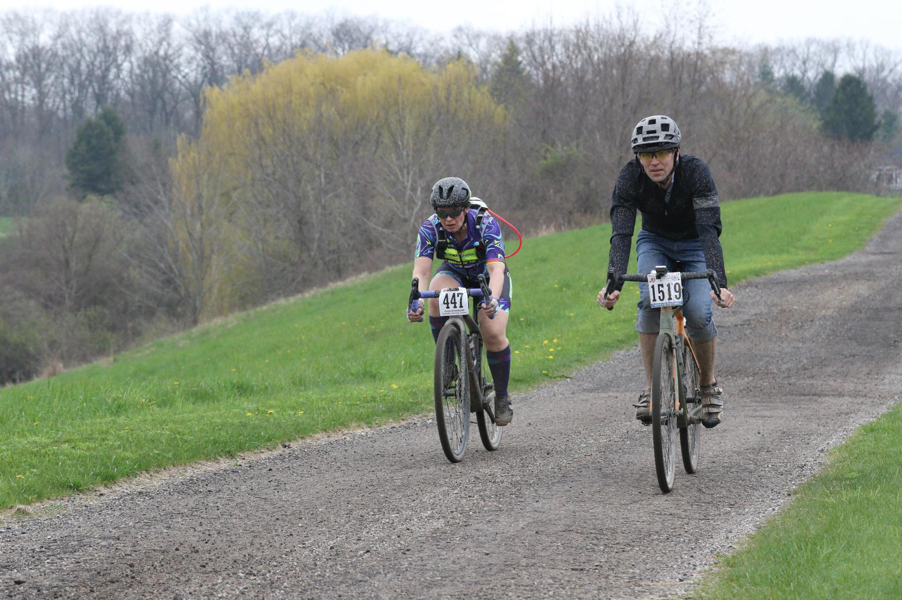
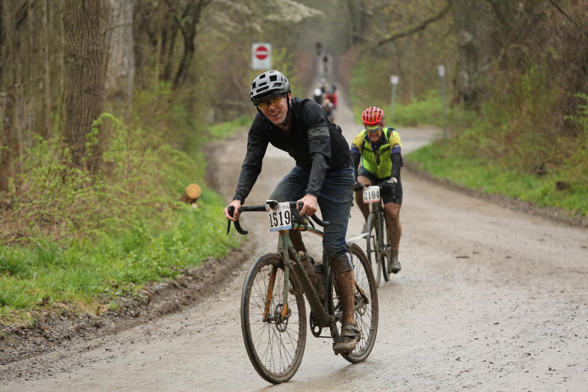
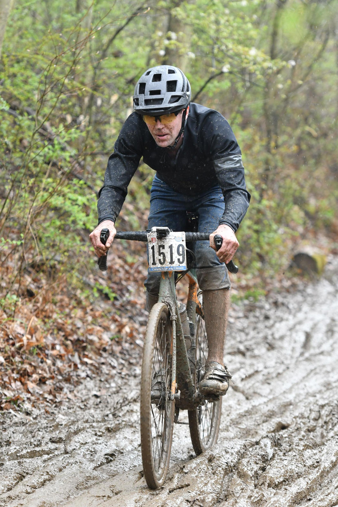
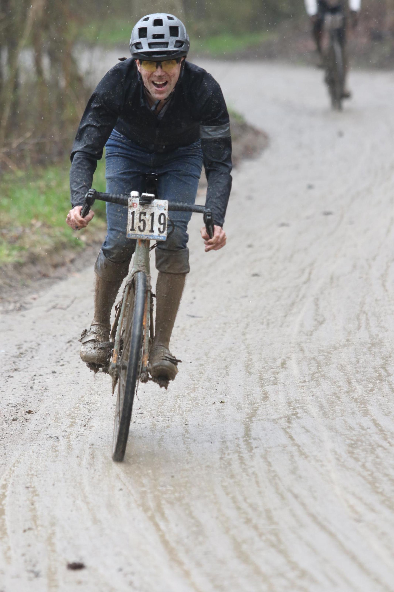
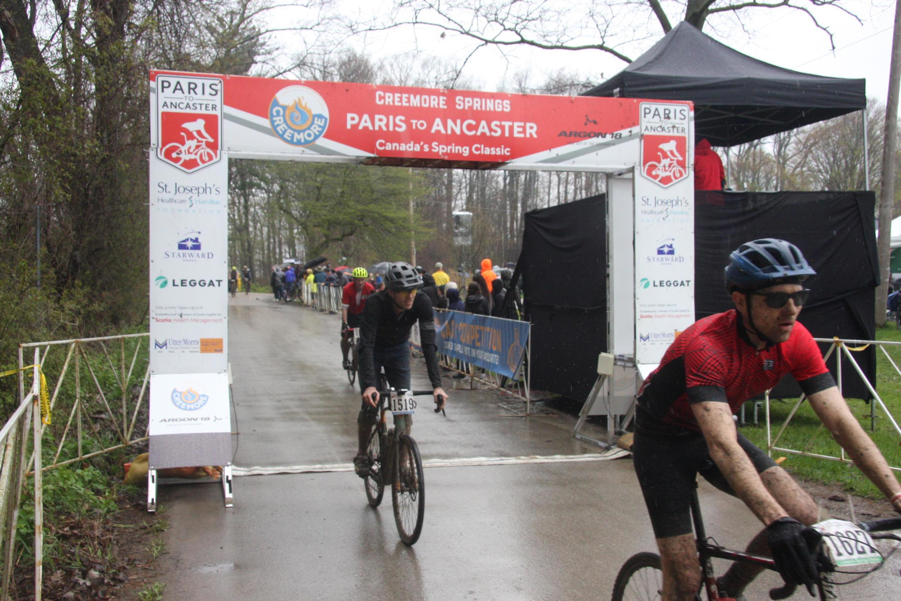

+++
title = "Race Report: Paris to Ancaster 2024"
date = "2024-06-20T17:38:26-04:00"
slug = "paris-ancaster-2024"

description = "Brake pads worn down to nothing; Du/er jeans are super good."
tags = ["bikes", "zestiness"]
+++

The Paris-Ancaster bike race is a multi-surface event with a variety of distances that occurs each year in the spring. We &ndash; myself and my friend Michael &ndash; chose the 68 km distance. He wants to do the race as a birthday gift to himself. I sign on because I have no good reason not to. Let's just get right into this.

### Gearing Up

The weather report heading towards race day started narrowing in on unseasonable warmth and humidity, also possibly rain but maybe not rain. I hum and hah about what to wear. In the end I throw a variety of crap into a bag and I can make my decision at the last minute based on how things feel at the start gate.

For my own records, I put a 60mm stem onto Grimey (from 90mm?) to reduce the reach which I think increased comfort. Maybe end up with 70mm but an improvement for sure.

### On Training

From sometime in the winter until race day, I did a decent number of multi-hour zone 2 rides throughout the late-winter. I had some other stressful stuff happening in the background so I wasn't able to do as much intense training (HIIT) as I'd hoped. _Note for next year:_ Do waytf more HIIT. Whether it be hills or just timed higher-intensity stretches of rail trail, need to deffo up the intensity. Why? Because riding three hours at above-training-level pace is less than ideal. Will hopefully be able to carry more base load into the winter this year so that we can come out swinging next spring. Also note: pistol squats, plyo leg stuff. Get strong AF. Which is for me at least a little bit strong.

### On the bike

For my own future reference, and I must insist that I am not proud of my setup, here is some the crap I had hanging off my ride and can be seen in the photos below:

- **Ass Savers Win Wing** (road width) fender on the back wheel. I liked not having the skunk-stripe and coldness up my ass and it never seemed to get clogged or anything. Might work again in the future, probably worth investing in the wider gravel variant. And shit, maybe even a **classic-style Ass Saver** would be suffish.
- **Ass savers mini-mudder** front mud guard. This thing clogged up like 9 times once we got into the thick tacky mud. It can go to hell. Commuting yes, **racing hell no.**
- **Apidura seat bag:** I don't think I ever pulled anything out of this, was probably just a weight penalty with no real gain. However it's also actually very light, so it might be worth including a few tools and pump and crap in there but keep it as light as possible. There's about a 0% chance you're going to pull over and get something out of this bag or add to it unless absolutely necessary.
- **Apidura stem bag:** this is where the magic should be stored, but maybe need to find a way to organize shit better. First, don't bring apple cinammon energy bars. I love apple cinammon energy bars, but you don't feel like trying to chow down on them when your heart rate isn't dropping below 160bpm and you don't want some lycra-clad superChad to blast past you while you waste your energy on not choking today (which is actually a great use of energy). _Bring gels instead._ Like _so many_ gels. Cram your water bottles full of gatorade. Carbs! Always carbs! Just keep a ton of sugar in this thing. Maybe even just cram the phone in here too. I had it in a jersey pocket and it was fine but got pretty gritty and scraped off a bunch of finish.

Furthermore, I ran a pair of 35mm width **Schwalbe G One RS tires.** Although these are great tires, I feel like something like my stock 40mm Maxxis Rambler might offer a little bit more grip and float in the muddier sections without adding much rolling resistance in the tarmac and gravel sections. Something to consider moving forward.

### Race Day!

I got surprisingly decent sleep the night before the race, and was up pretty early to finalize prep before Andrew, my chuffeur-and-photographer for the day, came by. Weather radar looks like rain will be likely, settle on wearing a normal short-sleeve jersey with a rain jacket over top. Also jeans. Yeah jeans. I just can't do lycra. I _won't_ do lycra. I will end up being refered to as "jeans guy" by a number of fellow riders.

For some stupid reason there is an officer blocking the route to the venue, so we double back and try another route. It gets us closer but we encounter more closed roads. We make the decision for me to ride the final 2km to the venue and Andrew would toddle off to scout his locations.

I find Michael in the parking lot-slash-quarry where the race starts, strap my plate to the handlebars and do some quick warm up spins. I'm nervous but no one really seems to give a crap that I exist. A light rain falls as we start getting into the right corral for our start. Thinking positive though! I like rain, this will play to my benefit!

### Race Start!

So we're in the start corral, I think we're at the back of **Wave 2**. There's a lot of people around wearing team kit, making me feel inadequate for sure in my jeans. Oh well, I hopefully have got this and won't somewhow embarass myself over the next few hours. As the time ticks down, everyone looks around nervously. Once the first wave is gone, we move up to fill the void they've left. I question my decisions leading up to this point. I remind myself that I'm just going to race my race and not get caught up with everyone else and going too hard out of the gate.

As soon as the start gun goes off to set us loose on the course, I abandon my resolve to race my own race. This pack of several hundred people set off and the speed is hard to resist. Michael and I are separated very early on. I see him a few riders ahead of me and step on the gas to catch up. He's a group of riders ahead of me. We go through a farmer's field, through some real muddy bits and he's gone. I think he's ahead of me so I jam on the gas again to find him. I stay on the gas. I am flying but also I am dying.

At some point we get onto some tarmac and I can see from the riders ahead that we've got at least a couple of km to catch him. I abandon my plan to not make any stupid moves and make solo unprotected attacks through open country. I do not catch Michael. I have no idea where he is. Aside from the hundreds of other riders and the police and volunteers and family members at every junction, I am utterly alone.

My anxiety ebbs and flows throughout this process. I enjoy riding along country roads, I take time to enjoy the surroundings, have some friendly chats with fellow competitors. I get many jeans related comments, I am Jeans Guy. Standouts included "messenger-style, right on" and "jeans? you fucking psycho!". Many ask me if they are jeans or fake jeans. I tell them the are Du/er jeans. Many people add that they love their Du/er jeans. I make new plans to become the Du/er jeans sponsored guy and try to live off of $5k a year plus race entry fees. I never follow through, another squandered opportunity.

### Feed Zone Number One

At some point after biking and biking and biking I arrive at the first feed zone, wondering if Michael would be waiting for me. He is not! I must have passed him in all the commotion. I am so fast. I am a great guy at racing bikes. I also feel like I am going to throw up, I am absolutely gased already and am not used to cramming calories down my throat at this pace. I take a couple of minutes to let a wave of panic subside and grab an apple to try to keep things moving. Top up water bottles with the sponsor's suger water. Where the shit is Michael? A lot of people are going by. Do I abandon him? I get a text from home - "everything okay?". "Just at feed stop, going to wait a few more minutes for Michael".

There's no way I'm _this_ far ahead of him. Michael's a few years older than me, but he trained a lot for this race. It becomes more and more obvious that despite this pace, he must be ahead of me. And at this point, un-catch-uppably far ahead of me. Alright, off we go. How long have I been waiting? Ten minutes? More? Oh well, let's get going, and from now on it's every man for himself.

We head out from the feed zone and into a horribly muddy little section. People are hopping off their bikes and running down the hill. The guy directly in front of me suddenly loses all traction and I have to semi-bail and skip along awkwardly to avoid damging his internal organs. Am I actually having fun?

### Mud. So much mud.

At some point we veer off the dirt road we are on and it's just a mudfest. Deep, tacky, sticky. It grabs onto my tires and doesn't let go. Trying to force my way through mud with a brick of compacted mud and leaves through my front fender spike my heart rate to 186bpm, my highest throughout the entire race. People are piling up behind me. I ride off to the edge of the cource and empty out the leaves. I am angry at my fender. It was supposed to help, not hinder! I get it cleared, I head back out. There is nothing but time to be made in this section. These are mostly _roadies_. Roadies have the most dogshit bike handling skills and can't ride singletrack to save their stupid little lives (aside: I'm fine with roadies, I just get weirdly competitive sometimes. I don't like Lycra though). But still I lost time because of my narrow tire choice and my stupid fender. **Note for next year:** no front mud guard. Wider tires.

The miles tick by. I settle into a nice rhythm. There is a lady who is going exactly the speed I want to go, which is slightly faster than my body would like to go. I stick to her back wheel. We exchange occasional words. We're starting to get tired. Everyone's pace has slowed. The 30kmh+ pace is a meager 25kmh. Some folks are able to keep up, but others are hitting the limits of their energy reserves and are noticeably struggling. I might be one of those people, I'm not sure. I am focusing on being okay. I am going to be okay.

### Feed Zone Number Two

Blasted past it hardly even realized it was there, having a chat with some dude on the rail trail. Definitely no Michael.

### The tail end of the trail

The last while on the trail is a bit unreal. A great long ride along some rail trail, Michael's training grounds. Getting towards the end of the course there is a really long and muddy downhill section, affectionately named the Mudslide of Death. A great many riders, both semi-exhausted and out of breath and of dubious bike-handling skills are jumping off their bikes and running down the mudslide. I am much more stupboarn. I will ride Grimey down the mudslide of death or we will be pitched into the adjacent forest together to think about the choices that have brought us to this point.

Now here's the weird thing. Despite having had borderline low blood sugar for an hour, having brakes that at this point have been ground down to nothing by the constant assault of gritty mud, I am somehow able to look like this is the best I have ever felt in my entire life. Get a load of this:

My feet are so muddy that the poor velcro on my ancient shoes has given up. There's chunks of mud hanging off from the bottom of my shoes or pedals or something. If you look closely you can see I am heading down a gentle incline _with my brakes fully engaged_ since that doesn't actually do anything anymore. My hairy calfs are carrying an extra half-pound of mud per side. Grimey is carrying another pound on various horizontal ledges. I've eaten enough dirt that my teeth have that after-dentist polished feel. And yet I am clearly having the greatest time.

And for those who must know, the thing sticking up from my back is either a paint stirrer stick for knocking mud off the bike, or an Ass Savers Speed Mullet I foolishly thought I might attach at some point to keep my feets clean. Ha ha ha yeah right. How young and naive I was!

But despite what you see, I felt like hell. But we're getting close to the end! There's just that one big climb that everyone has warned me is awful. And my quads have begun to spasm if I stand and pedal. Stupid legs. But I will prevail!

The final climb is where I get my heart to its second-highest peak at a mere 183bpm. I try to finish strong. I run out of gas halfway up the hill. I tried to force my way up, mind you. At some point I was straining and closed my eyes and felt some sort of weird flash or something like something broke in my brain so I took 30 seconds to just stop and collect myself. I can hear the crowd cheering up ahead. I will finish strong. I start pedalling, get some momentum and am able to force the pedals to spin to the top of the hill. And just like that, it's all over. I swear that this sucks so much and I will never do it again. But I've reached my goal of completing the race. Yay me.

### Denouement

So I caught up with Andrew who curses himself to have missed me making my way across the finish line. That's okay. We find Michael. Michael kicked my ass. I am happy for Michael. Because I know that next year when we do the race, I will crush him. And just like that, I've decided that I will in fact do the race next year.

Bikes get washed, food gets eaten and life goes on. It was a good time. I'm not a people person but I still enjoyed it all when I could and I retain fond memories already. I've already begun making notes on things I did right, things I did poorly and how to improve things for next year. And you've just read most of them.

Until next time, keep fit and have fun. Bodybreak!
