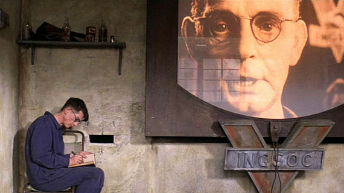

The world has a lot of shitty aspects to it.

There's lots of good things too. The Scottish Highlands, animals, warm hoodies on chilly fall days.

> I am so glad I live in a world that has Octobers.  
> -Anne, of Green Gables

### A long time ago

Back when I was a wee lad in my mid-twenties or thirties or so, I was in the market for a keyboard that wouldn't tell Big Brother what I was doing *all the fucking time*. Not that I have anything to hide, but Big Brother and I don't play on the same team, and I don't feel like helping him out of the goodness of my heart.

I found a nice little app called Swiftkey Keyboard. It had swipe typing! Press down on the first letter and just drag your finger over all the other letters and the word magically appears. As a grumpy old fella who does not appreciate shit like typing on a phone, this was great. I even paid a few bucks to support it, because despite what all of my critics say, I will pay for something that provides value. Thanks, Swiftkey!

### Buuuuuuttt...

Microsoft also noticed that people would give Swiftkey money annnnd that was the end of the party. They acquired it. Microsoft Swiftkey Keyboard. As someone who believes that an entity who's entire purpose is to provide returns on investment maybe doesn't have the best interests of people and the planet in mind, I bailed ship.

Well, that's not entirely true.

I *tried* to jump ship. All the other keyboards I looked at seemed even more scammy. I mean, think about the treasure trove of information available to the person who can surreptitiously record *every fucking thing I communicate in text via my phone*. Passwords, private messages, fatness of fingers. That seems like exactly what executive-types get boners over and will absolutely abuse and do their best not to get caught abusing.

Problem was, there only really seemed to be one option available on Android that actually tried to respect user privacy: [Simple Keyboard](https://f-droid.org/packages/rkr.simplekeyboard.inputmethod/). Now don't get me wrong, I very much appreciate where their heart was at. It is a simple keyboard. But as a highly-sensitive individual, I couldn't go back to not-swipe typing. I JUST COULDN'T. Around this time I was also investigating using a speech-to-text app to do some of the heavy lifting.

And guess what.

They send every fucking word you say back to home base and on to some ad agency to send you personalized ads and also probably determine what the thing you fear the most in the world is so that when they have you in Room 101 they can use it to completely break you so that when you leave as a husk of your former self all that's left to do is sit in the café drinking Victory Gin and not even flinching when the former love of your life walks by.

So I gave up.

You win, Microsoft Swiftkey Keyboard. You w-

### Immich Launches a Stable Release!

Also because I don't want Google to have possession of every single photo I take, I've begun using a program called [Immich](https://immich.app/) to back up my photos. On the upside, the photos are just backed up automagically to a server I have running in my basement because I am a nerd. [Aside: a server is just a computer. Seriously.]. So recently, on my favourite [nerd info source](https://hackerweb.app), there was a post about how Immich released a new version. Neat!

So I went to check out was new.

Not much, honestly. They promised better stability. Awwww yeah. But for real I appreciate stability in my photo backup app.

But something else caught my eye on their website.

FUTO.

Just what appeared to be an acronym. In the footer of the page. I have no idea why, but I clicked on the [FUTO](https://futo.org) link. I still don't know what FUTO stands for, if anything, and I kind of enjoy it that way.

### Swiftkey please fuck off

Scrolling down the FUTO landing page, I see that they are user-centric. Privacy-centric. Lots of products I trust seem to be in cahoots with them. Aside from Immich, this also includes [Signal](https://signal.org) (please download and start using Signal) and [VLC](https://www.videolan.org/vlc/) (a video player that is free forever and will open every file type). Good signs...

And I noticed [FUTO Keyboard](https://keyboard.futo.org). "Yeah, yeah", I thinks to myself. "Some shitty shit keyboard whatever".

Click the link to investigate FUTO Keyboard.

Top of page reads thusly:

#### Your keyboard shouldn't connect to the internet.  
##### We are building a modern keyboard that respects your privacy and security.

Reading further:  
"Swipe to type"  
"Offline voice input"

Annnnd just like that I am downloading FUTO Keyboard repeatedly trying to not get my hopes up and simultaneously willing it to not suck.

I am not disappointed.

The webpage did make mention that is is in `ALPHA` which means it is still a work in progress.

But it does what it says.

It swipe-types.

It does a *good job* of locally translating my sounds into screen letters and words.

### The future is less bad

Two hours go by with a few tests and MICROSOFT SWIFTKEY GETS THE HELL UNINSTALLED. \*crowd goes wild\*

  
GET THE HELL OUTTA HERE!

And just like that, the system has a little bit less of a grip on me.

Little has changed, and yet everything has changed.

I have performed one small action that has liberated me from a cage that I unwillingly accepted to be held in. I know there are still many ways that **the man** is spying on me. Knows my location at most times. I mean shit, I upload a ton of workout information to Garmin and a few other tracking sites regularly. But at least for right this second, hopefully **the man** doesn't have every fucking thing I type on record, even if I never actually do anything with said text. Even if I write it and immediately remove it without sending.

So, Microsoft, get bent. You can read all of my work emails, but you don't get to siphon off my deepest thoughts that are only otherwise stored nicely encrypted. You don't get to know that I am running late and should be there in 5 minutes when we all fully know it'll be at least 15.

And thanks to the people out there who still believe a less-terrible world is possible.

The world has a lot of shitty aspects to it.

But it also has a few boffins that help the rest of us sleep a little easier at night.

FUTO: Shut up and take my money. And thanks.