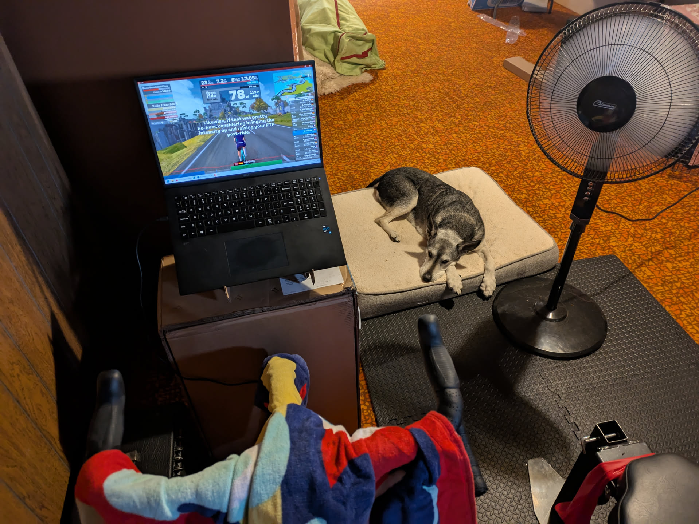
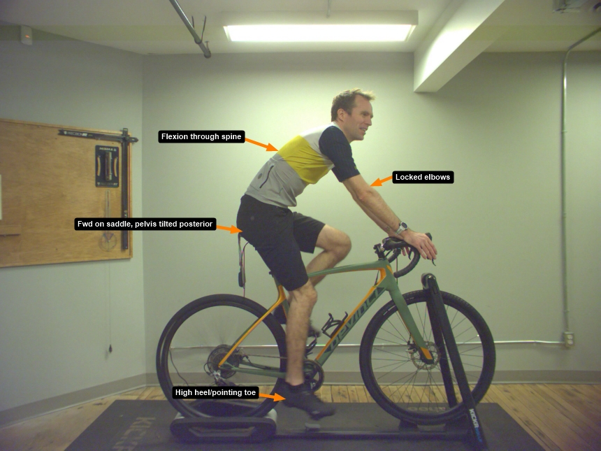
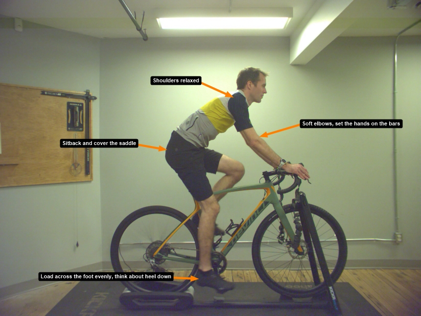
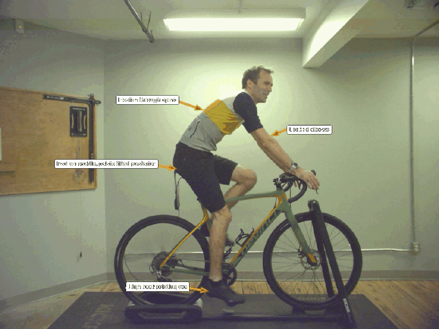

+++
title = "Grimey fits me now!"
date = "2025-01-13T17:38:26-04:00"
slug = "bike-fit-grimey"
description = "Wherein the hero elaborates on his recent bicycle fitting experience. Yes, that's a thing."
tags = ["bikes", "zestiness"]
+++

Since I've started doing longer rides, I've always been fighting through some niggle or another. Well, that might not be entirely true. When I first got [Grimey](./the-windiest-135km-bike-ride) I had a Brooks leather saddle and it was comfortable as heck until I got rid of it because it was leather and my bike stuff needs to be able to get wet and muddy and love it and not need any coddling. So ever since then on long rides, my shoulders get sore and my trapeziuses get sore and my perineal area gets sore and so on and so forth.

### Crushing basement Kay-ems

As part of my newfound dream of getting a bit faster, I decided to lay out some self-improvement bucks and grab a WAHOO Kickr Core smart trainer and a subscription to Zwift. Sorry no affiliate link for trainer but hey get a [free month of Zwift!](https://www.zwift.com/invite/JtsLTQfeEK). So now I get to ride Grimey all winter in the basement and also enjoy some crappy graphics. Thanks, Zwift!

So at some point last year I decided that a good way to get faster was to *throw money at the problem* which is always a good thing to try. It keeps the economy going which is very, very important to consider when doing literally anything. But then at some point I realized: that's stupid! I was trying to buy my way to faster when what I should have been doing was *buying myself faster but in a different way*.

After some serious soul searching I realized that it's not Grimey's fault that I'm not riding Grimey faster. It's **my** fault and I need to start taking some responsibility for my actions. DAMN IT, I hate taking responsibility for my actions. So I got the trainer and all that and resolved to open up the new year by finally spending some of the Wellness Money from my benefits plan to get a professional bike fit from the Local Bike Shop. I was hesitant. What can this idiot know that twenty minutes of youtube videos can't teach you? Well, a lot as it turns out.

### Getting knocked down a few pegs

First off, my bike is the right size for me. You hear that, Grimey? They're not going to force us apart! However, over the two hours that Tim the Bike Fitter and I spent together, there were a number of changes to help improve my situation.

- My arches are high! Need to add some fresh insoles to support those things.
- Based on the insoles removed from the shoes, all of the pressure was on the ball of the foot right behind the big toe. This is less than ideal! Spread the power across the entire pedal spindle. This should help to align the leg from hip to toe and decrease injury likliehood. This is something for me to consciously work on.
- I ride in a toe-down style. This is less than ideal for power transfer and biomechanics. Now I need to also work on keeping my heel down throughout the pedal stroke. Hold on, I need to write this down.
  - Spread power across all metatarsals
  - Keep heel down while pedalling
- So wait, is there a reason why I pedal in that way? Oh, my hamstrings are tight as heck. So now I get some exercises to do to lengthen and strengthen the backside of my lower body. Romanian deadlifts and glute bridges. Yay, homework!
- Oh and also as a result of tight hamstrings I am also rounding my back to give them a little extra space. Also because I have bad posture in general like literally everyone else.
  - Keep a neutral spine while riding.
- I complained of pain in the perineal area, which is more commonly known by another more crass name. Anyway, I don't sit far enough back on the seat. Like an asshole! So I need to make sure I sit further back on the seat as well. This should help keep the pressure on the sit bones and not the soft fleshy perineal area. We leaned the seat forward a couple of degrees as well. I think at some point I tipped it back to try to not slide forward but clearly that didn't work.
- Handlebars rotated forwards but brifters rotated towards me and also angled inwards. This allows a more full grip to distribute pressure across the hands and anglaed inwards to increase aero and maybe also comfort.
- Also we replaced my ten-years-of-riding cleats which it turns out has a massive difference. New cleats just lock you right down to the pedals. I like it!

### Before and afters!

Look, words are stupid. Lets just have a look at the before picture:

So obviously I look like a hack and that if I'm ever able to ride more than 50 feet without falling off it'd be a miracle. Well, maybe it just looks uncomfortable for more than an hour of riding at a time. Okay so now let's compare with the after:

Okay yeah it looks the exact same to most people. So here's a flip-flop of before and after:

See?! You can also see we made the stem more longer (part that holds handlebars).

### Verdict?

I like it! I've been doing my exercises and trying to be disciplined about spreading out power across the spindle, keep my heel low, keeping a neutral spine and getting my ass back on the seat. I've done a two hour ride on an indoor trainer and it was not awful! Sure I had to stand a couple of times to relieve some pressure spots but nothing major. So yes, given that I had a few bucks that I was able to spend on it, I am glad to have made this investment.

Riding indoors is a great way to keep fit in the winter. If increasing comfort and minimizing injuries will help make it less awful, I'm all for it.

Bike fits = good. Not like Bike Rage fits, but this kind.