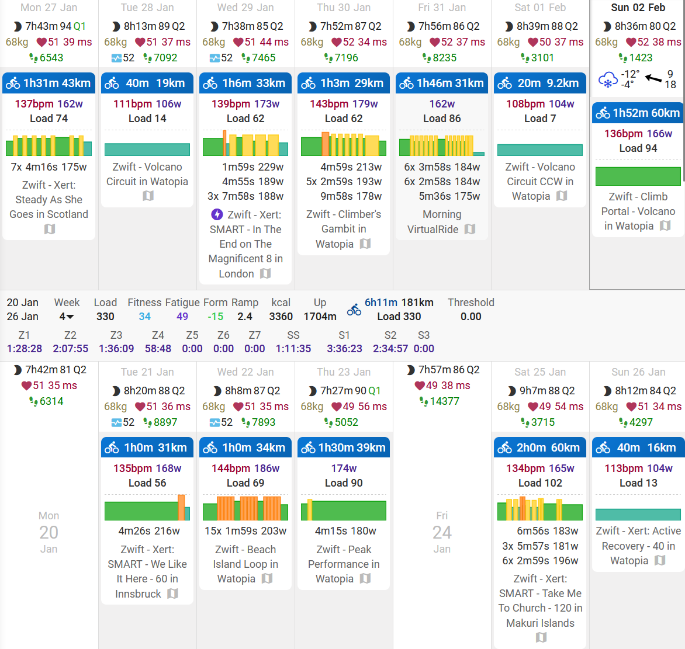
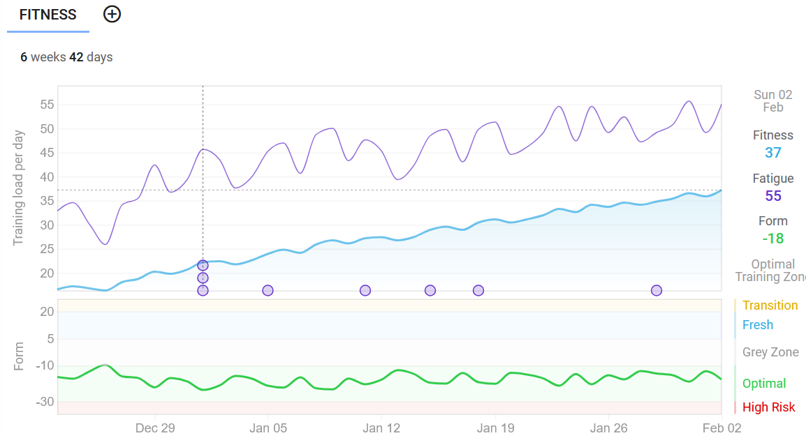

+++
title = "Training Update: February 2025"
date = "2025-02-02T15:29:26-04:00"
slug = "training-update-feb-2025"
description = "Wherein the hero elaborates his cycling training since its inception in December 2024."
tags = ["bikes", "training", "zestiness"]
+++

### Preamble

At some point last year like the dumbass that I am, I thought it would be a good idea to spend my wellness money from work on a pair of relatively cheap [aero rims](https://www.elite-wheels.com/product/elitewheels-drive-g45-ss-gravel-bike-carbon-wheels/) from China.

But then I did some soul searching because I realized I was trying to throw money at riding faster. If you do a quick doodle search, you'll quiclkly learn that getting aero rims is [one of the most dogshit ways to spend your money to get faster](https://www.cyclingnews.com/features/get-aero-for-less-we-rank-bike-upgrades-ranked-by-watts-saved-vs-cost/). So there's that.

I'm a bang-for-your-buck kind of guy. So I threw that plan into my mental recycle bin and hatched a new plan: I'm going to actually train and see if that can make me faster. So I bought a Wahoo Kickr Core smart trainer and here we are.

### How things started: December 2024

I hooked up the trainer and subscribed to Zwift and went and did an FTP test. FTP is functional threshold power, which is the estimated amount of power one can sustain for an hour and underscores a lot of what you do while training. My inital estimated FTP according to a Zwift ramp test was **225 watts (W)**. I don't know if this is good or bad. I feel like it should have been higher but that's the number I am working with for now. The next day I do a benchmark ride and it seems right. Sorry, my pride.

I enroll in the FTP Builder workout on Zwift a 6-week set of workouts with about four or five sessions a week. I start training. I train good!

At this point I decide that if I'm going to be sitting in my basement for hours trying to be more fitter that it's a good investment to get a [bike fit](/bike-fit-grimey).

We can jump ahead to about January 18th, the end of the FTP Builder program. All is well, I am nervous about burning out but have been sensible about it and used [intervals.icu](https://intervals.icu) to track my recovery/form. My new FTP? Well, here's the rub: *I never checked my FTP at the end of the FTP Builder*. I know. I'm a bad content creator.

So y I no check? I was looking at my options for the next level of my training. The most obvious was [TrainerRoad](https://www.trainerroad.com/), but I ended up putting my trust into a more local choice - [Xert](https://xertonline.com). This platform uses all the info from my trainer to determine that workouts that will help me reach my goals.

Having something give me options for workouts is nice because it makes it so there's one less thing I have to think about and they have enough variety to keep me from getting overbored.

### How it's going

So Xert has been providing a number of suggestions for workouts for me. I've gone from a weekly training stress score (a measure of how much training you're doing) from 252 in early December to this week being 399. They provide a graph showing roughly this as the blue line on the following chart from intervals.icu:

Ignore the purple line which shows Fatigue (7 day weighted average of training load) but lets focus on the blue line which is Fitness (42-day weighted average of training load). It makes me happy and keeps me motivated for now to see that line going up and up. Apparently I've vastly increased my training load but I still feel about as tired as when I was much earlier on in the program: I may actually be getting more fit!

The green line underneath is Form, which is Fitness minus Fatigure. The line being green is good, means I am increasing fitness at a sustainable level. Red is bad and risks burnout, grey is stagnation and means I am not improving. Once I am race-ready I will ramp down the training load which will increase that line hopefully into the "Fresh" blue category and my body will just be jonesing to give'er at that point. Neat.

### Where we're going next

So in plain english, I'm doing easy rides these days. Relatively so. I did a two hour ride this morning and was tired but still feeling quite good afterwards. A few hours later I did some weighted lunges and single-leg Romanian deadlifts and stuff to try to add a bit of extra strength.

The Xert program I am currently using is event preparation. I told them about my target event (P2A at end of April) and it has set me up with a three phase program: Base-Build-Peak.

Right now I am nearing the end of the **Base** phase of the program. This is ultimately the answer to why I didn't do an FTP test. It doesn't fit with my updated plan. The base phase is just adding a lot of training volume (time) without adding much intensity. My body making a bunch of new mitochondrias and getting good at turning glycogen into lactate and then turning the lactate back into glycogen. Training my quadriceps to recruit lots of muscle fibers in case some start to get tired.  Increase my red blood cells count so that I can move them oxygens through my bloodstream more easier.

Next up is the **Build** phase, which starts around February 11, I think. I have a feeling that that's where the suffering is going to increase substantially. The workouts will start adding much more high-intensity intervals to increase my VO2Max, the amount of oxygen my body can process and get to the muscles over a given time. But this comes at the expense of overriding the signals that my legs are sending that they've had enough. But hey, I guess that's training.

The final phase is the **Peak** phase. In my case as an amateur weekend warrior, this will involve more of an increase in training load and more specific intervals to really push the body to its limits before tapering before coming back stronger. I'm really going to be monitoring my form and recovery during this phase because this is where the risk of overtraining is real.

### Denouement

So far, so good. Hopefully fitness is improving just by showing up for every session.

Motivation is still high, looking forward to the race. Not looking forward to more high-intensity intervals but yes interested to see what Xert estimates my FTP at once I get to that point.