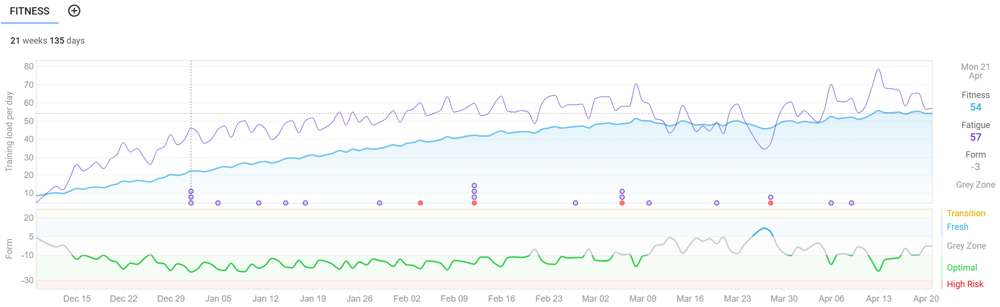
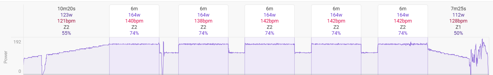
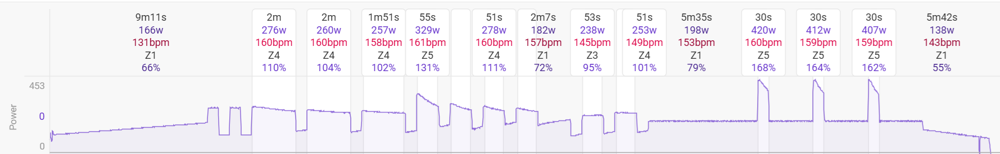
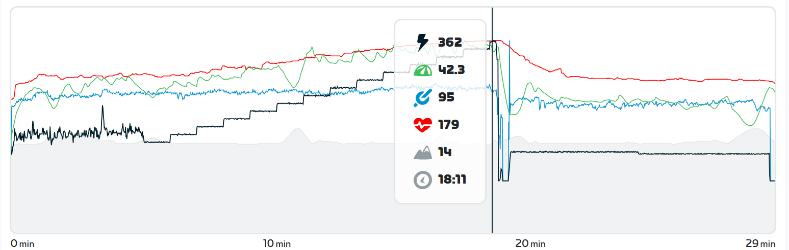

+++
title = "Training Update: April 2025"
date = "2025-04-21T19:14:26-04:00"
slug = "training-update-april-2025"
description = "Wherein the hero continues to elaborate his cycling training since its inception in December 2024."
tags = ["bikes", "training", "zestiness"]
+++

### Preamble

I've been meaning to update this for a while. But I've been training and whatnot. So I never wrote a blog entries about how training has been going.

The race is in 6 days. I have begun my taper period where the volume of training (but not intensity) is diminished. This should result in my maintaining fitness but allowing my body to fully recover so that by race day I'm all fired up and ready to haul ass.

### How things have been since February of this year

Nuts to that lets go back to December. I've screen-grabbed from [intervals.icu](https://intervals.icu) a visual representation of my training load since December, when I started training for this year's Paris to Ancaster race:

The main thing that is of concern in this graph is the blue line, which is the long-term training load. When I began in December, that number was 9, which may in reality be a mild underestimated but close enough. In my last update at the start of February, it was 37. Today as I write this, it stands at 54, a slight decrease from its peak at 56. Woo! So what does that mean? Between the amount of time spent on the bike (volume), and the effort of each of those rides (intensity), my training load has increased a shit-ton since I started this season.

Here's an example. In the winter, I rode 5 days a week, and the power profile of a workout looked like this:

This was of course the base phase, but I remember even during this time that my quad muscles were often tired and sore. Which was good, I feel like I built myself up in a decent amount of time instead of being ridiculous and being in a lot of pain or running out of gas and getting discouraged as I so often do. More recent rides have looked more like the following:

This was a challenging-but-doable ride. I definitely came off the bike one hell of a lot sweatier than the ride in the previous image. But I would say my legs were no more sore than they were after the easier sessions. So, good! Training achieved!

### That blip in the training load figure?

Work went haywire. Extra stress, extra brainpower. According to my Garmin watch, my heart rate variability (HRV) was showing that my stress wasn't being managed well. I dread overtraining and/or burnout, so I hit the brakes for a while then just rested for five days, which is where the form line underneath that blue line briefly turns blue as well. That indicates my training status was *fresh*. And what do you do when you're fresh?

FTP tests!

So I was all fired up from having rested for a few days and decided to go hard. I put on Andrew WK's masterpiece "I Get Wet" and set out to do a Zwift ramp test, which is a great way to overestimate FTP but this is the way I did my first test so may as well be consistent. Have a look:

So the test starts with a warm-up, then you ride at 100 W for one minute. Then you ride at 120 W for one minute. And so on and so forth until you literally cannot push the pedals any further. At which point a little window pops up and says "you done?" and the acknowledgement says "I'm Toast" which hopefully you feel honest in pressing in that moment. Then I forget but it's something like 75% of your best minute of power is your FTP, which is kind of like weight in that its mainly an estimate and no one is entirely truthful about theirs.

So in December when I started, my FTP was clocked in at 225 W. According to this test on March 28, my FTP was estimated at 261 W! That's a 16% improvement in four months, I'll take it! However, my two other training programs (intervals.icu and Xert) both set my FTP at 250 W based on probably more realistic algorithms so I'll use that. But still, yay me! I am actually a little amazed that effort and consistency actually make a difference.

Downside: the difference between 225 W and 250 W is 11%, so all of my workouts just became 11% more difficult which actually kinda sucks shit for the first couple of weeks. And now we rinse and repeat.

### The future

One more week of easier rides, it's nice to look forward to summer. Not entirely sure what will happen after the race on Sunday. The local mountain bike trails should be thawed, so hopefully I am inspired to go out for lots of rides and enjoy the great outdoors. We're probably going to sign up for another race in early June, so I don't think that structured training will be too far away, but I also think it's probably good to just ride to work and have some adventures and not just get weird about numbers. No orthotrainia.

I think I've got all my nutrition sorted for the ride, hopefully my gear will be suitable for the myriad possible temperatures on race day. And really, I hope I have fun and have the mental clarity to enjoy race day.

### Denouement

I am glad I purchased my trainer. It gave me something to think about over the winter, and has hopefully let me feel good about myself. I enjoy having these objective numbers that I can't poo-poo when I am feeling dumpy. There's hard evidence that fitness is improving, and that is good for me.

A few more rides, lots of rest and hopefully some good healthy meals and it's game on.