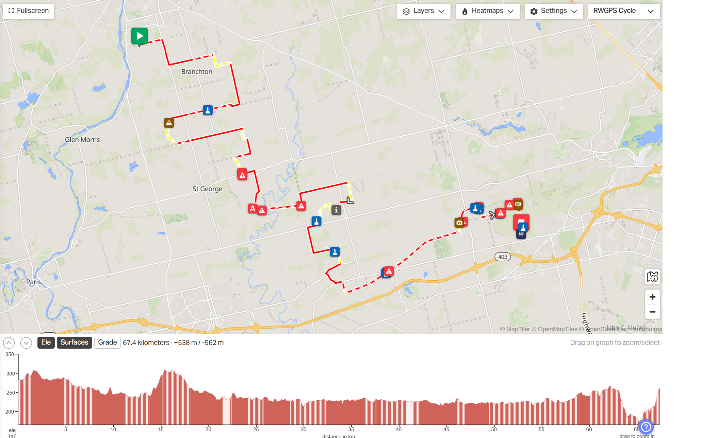
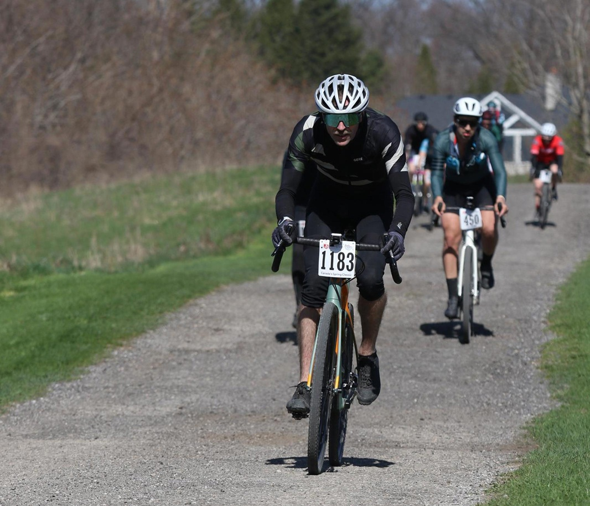
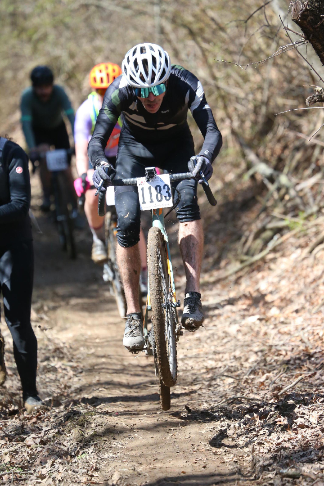
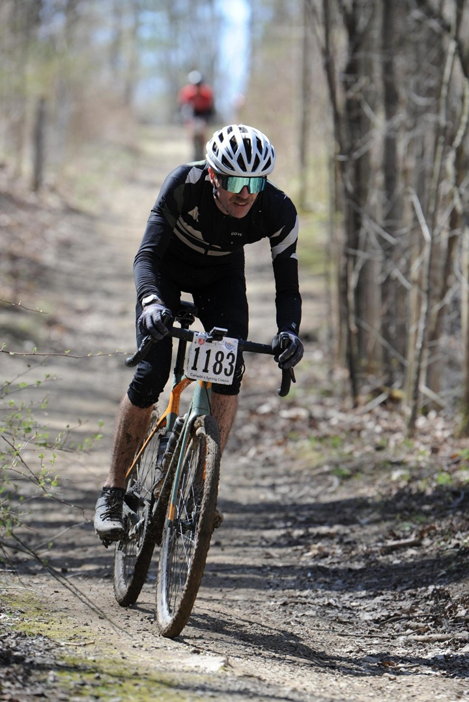
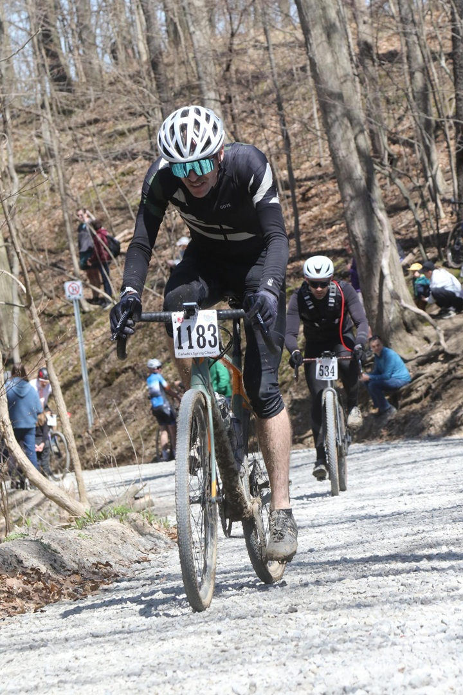
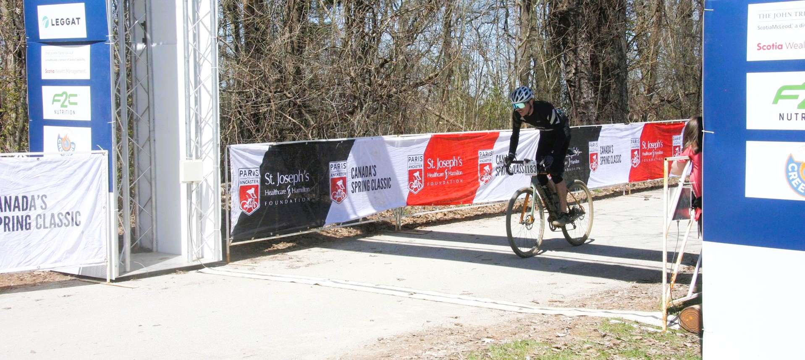

+++
title = "Race Report: Paris to Ancaster Classic 2025"
date = "2025-05-03T07:30:26-04:00"
slug = "p2a-2025"
description = "What happened at the race. Spoiler: went well."
tags = ["bikes", "racing", "zestiness"]
+++

### A new day dawns

The weather for this year's race was really good. The day dawned clear but cold, an overnight low of 2°C and forecast to remain clear with a daytime high of 17°C. There was a light breeze in the air coming out of the northwest which meant the best news possible: most of the course would have a tailwind!

Speaking of the course:

On the elevation profile, the stripey bits are non-paved. Nice! The yellow bits are private property, and even though there's a good chance none of them will ever read this, we're super-appreciative of the landowners for letting us toot across their property, it adds that extra je-ne-said-quoi to the race.

### Gearing up

I pulled into the parking lot behind the sedan of my friend and coworker MM. It was still very chilly, toques and gloves were in order. We arrived very early and so had lots of time to hum and hah about what layers would be best to don to ensure thermal integrity during the race. Like how to not freeze or cook. I opted for light socks, bib shorts, and adding an extra base layer shirt along with the jersey and arm-warmers I was expecting to wear. Also some knee-warmers which are also knee-covers because I've always been self-conscious about my knock-knees. That's right people with greater than 12% body fat, skinny people are self-conscious too.

I figured I would wear some lightweight gloves to break the wind and I could remove them and toss them into a pocket if necessary.

### Bike setup

Last year I ran a couple of Ass Savers fenders and found that in particular the front one tended to get real gummed up with mud so those were both gone and I only used the original-style Ass Saver that attaches to the seat and is exclusively designed to keep the butt crack devoid of water and mud. I can deal with getting muddy but not wet-butt. A lot of people ran nothing and were fine, but a lot of people aren't awesome and ride directly through puddles and instead they try to ride around and slide on the edges and just fall into the puddles. I am happy with my decision, no wet-butt and very small weight penalty and no aero penalty.

It was awesome having [Grimey fit me](../bike-fit-grimey) better this year. It took a few efforts but I've settled on the Ergon All-Road Pro saddle which is a good fit for my butt. Felt good through the whole race.

I put my numbers into the [Silca tire pressure calculator](https://silca.cc/en-ca/pages/pro-tire-pressure-calculator) and settled on 38 psi for the back tire and 36 psi up front. No notes, seemed to run well. Tires were 40mm Maxxis Ramblers front and back. Worked fine for these conditions. Enough traction in the few spots I needed it but didn't seem slow in the fast bits.

I got rid of the seat pack this year but kept the feedbag. This also included a bacon-apllicator to plug any possible punctures that selant can't seal and a spare chain link to quickly fix a chain break. Unlikely but super light so why not. Not a bike set-up necessarily but I also brought a pump and multitool that I kept in my jersey pocket. The feedbag also contained a bag of energy balls.

### Nutritions

Brought a bunch of homemade apple-cinammon energy balls and had trained on ingesting one ball every 4 km. Brought two 750mL water bottles, one with gatorade and one with Skratch hydration mix. I didn't expect these bottles to get me through the race but I knew where the Aid Stations were and thought it would kill me to pull over and load up a bottle with on-course energy water.

Note to self: at race pace, there's no getting those energy balls down gracefully. Calories will need to be liquid or gelly in the future.

### Pre-race jitters

We're going back a few days here, but being the anxious type I had been having nerves for days, but managed to get a good night's sleep the night before. It was a good move to get on the bike and start spinning the legs. Bikes are my safe place. I feel a few dropped heartbeats but know that it's more than likely just nerves and hyper-awareness and don't worry about it.

I ride around the start area for half an hour, real gentle but varying cadence from very slow to like 110 rpm. I go from being freezing in the windy shade to being nice and toasty in the rising sun. There are people doing the same on a variety of bikes, being of various ages, types of kit, styles of gear. These people are not laughing at me. I have only once on a training ride left the house in full tights, and that was a week ago with no one around. We are all in our own worlds, silently or in small chatty groups pondering the suffering we're about to expose ourselves to.

With five minutes to the start, we herd into the starting corral. We are in Wave 1! We are the fastest! MM disappears into the fray, I later learn that he has jammed himself up to the second row. I am not interested in frays and end up near the back of the group. I don't even know if I am in the right place. A fellow racer is trying to determine if he is in the right place and unfortunately I am not able to give them much direction.

"I just asked because you look skinny and fast" he says.

My heart warms. "I am for sure one of those things" I reply with a nervous chuckle.

My legs are shaking as the clock counts down. I am feeling okay, I continue to take nice, slow breaths. I have trained a lot. This will be fun. Biking is fun.

### Up out of your seats, let's blast!

The starting gun goes off! Well, a few seconds after the start time, some sort of technical issue on the gun side of things. They're off! I watch as they head off at full gas. I am at the back of the wave, so it takes a good ten seconds before the folks in front of me are able to move. Even by the time I get to the actual start line, a gap has opened up and I'm able to hit the gas and start moving at a good clip. Before long I'm at the back of a pack and immediately regret starting at the back of the wave. But I've got a plan: stay on a wheel and don't do anything stupid.

For the first fifteen minutes or so I jump from wheel to wheel, drafting from anyone that I can and jumping to the next person when my heart rate drops a few BPM. At about 25 minutes and 14 km into the race, we start up the Glen Morris hill. The whole course is relatively flat save for this, a few rolling hills near the finish and of course, the Old Martin Road climb to the finish. The Glen Morris hill isn nothing too special, but it is at this point that I have a realization: I can climb like a son of a bitch! I've been conserving energy leading up to the climb by staying out of the wind and tucked behind other riders, knowing that I want to blast up this hill. And I do!

People are standing still as I climb this hill. My Jack Skellington physique is working for me! My power-to-weight ratio is good! I know they are pushing, but it just seems relatively effortless for me to continue on. I thank my training regimen for the knowledge that it will take me only a few minutes to recover from this effort. I am feeling good.

The day is very nice. The temperature is probably flirting with double digits, when I break focus occasionally to pay attention to my surroundings, it is a great day to see how fast we can ride a prescribed distance.

Last year I declared that I wouldn't wear Lycra, that I *couldn't* wear Lycra. Well, turns out I can if it means more faster.

At some point I see MM in the distance! I am elated, I am catching up to MM! I pull up alongside and say hello.

"Hey homeboy! How goes?" say I.

"Yeah..."

Uh oh, things are not going great for MM. I find out after the race that he may have had his foot on the gas a little heavy at the start of the race and the rest of the ride was a bit of a slog. But to his credit, he still had a good time!

As I was catching up I came as close to crashing as I did the entire race. Back tire lost traction around a speedy loose corner, nothing too serious but good that that was the worst of it.

And hey look, after smashing through the middle of the Mud Chute O' Doom or whatever it's called, I had the wherewithal to do a bunnyhop for the photographer! I was mostly focused, but sometimes bunnyhop trumps focus.

Going down the rail trail was good stuff. There was a group of twenty or so people and at one point I was all rested up and tried to make an attack and hope enough people would follow me that I could then just jump on board with that group. It worked! It was like a shot in the arm of the group, kept people from becoming complacent with our situation.

And then after going through some singletracky bit.. .. I ended up being almost alone out there. Good time for the photographer to be nearby though. It was a very end-of-race-heavy photographer scrum.

For future reference: two 750mL water bottles are not enough hydration. I got another bottle from a kindly gentleman right near the Aid Station. But it was a screw top bottle. So I was able to get giant gulps of it down on flatter sections but far less than ideal. I can feel the gas tank emptying but am still doing pretty well.

For future reference: let's go back to that "I climb good and therefore am a god" paragraph. I noticed throughout the race that when we weren't climbing, that in fact I seemed to lose time to these other people, or at least seemed to require more energy to keep up. This might just be a thing where I'm weird, and happier to put down power up hills than elsewhere. But probably also worth adding some more resistance training might help to blast out this type of flatlander. Not sure if I understand my own logic but hey it's a weakness. Do squats. Do lunges.

Approaching the final climb, I had come even with a gentleman that had been ahead of me at times, and eating my dust at times. I remember what I said to him at this point.

"I've got no deeper left to dig."

"Once more" he responded, and we settled in.

I could hear the crowd cheering people on up ahead.

I don't want them to look at me. I am tired. My legs have so little energy left. I try to push too hard on the pedals which results in slips and wasted energy. I settle in. I force my legs to keep moving. I had been thinking of this moment for months. I will not let the hill win. I keep pushing. I spin to win.

It looks like this:

It is a little disappointing that I don't have nearly the grimace on my face that I did in my brain.

Eventually, after a short eternity, the hill levelled off. And the finish line was in sight.

They didn't capture my dope bunnyhop across the finish line. I know I didn't finish in first place which of course was a crushing blow. I rested my arms on the bars kitty-cat style and took some deep breaths. I cruise out of the finish area and do a few laps to cool down. Shortly thereafter, MM came cruising across the line, apparently feeling toasty warm as a result of only really considering the day might be too cold. But in good spirits.

We change into civvies. We get our free 341mL tin of Creemore Brand Alcoholic Product. We talk about our day. We hop on the bus back to the start line where our cars are. We drive home.

### Some numbers

Last year I didn't talk numbers a lot at the finish. Last year I felt like hell, had cramping legs. Stopped to wait for MM. If we're being honest, I wasn't doing super mentally and that break was also a chance to let my brain stop being on overdrive.

This year went much better. I trained about ten times more than last year. I focused on training. Structured training. So I was quite happy to not having cramping legs, to feel good from start to finish, if not fading a bit toward the finish. But that's good, there's improvement to be made.

I finished in a time of 2 hour and 22 minutes and some seconds. 18/200 in my age group, 91 out of ~940 in the Classic distance. Going up the final hill is timed. I'm quite jazzed to have made it up the hill in 57 of ~940 in my wave. I was planning for top 50% of my category and hoping for top 25% so quite happy with this result.

### Final words

Be excellent to each other.