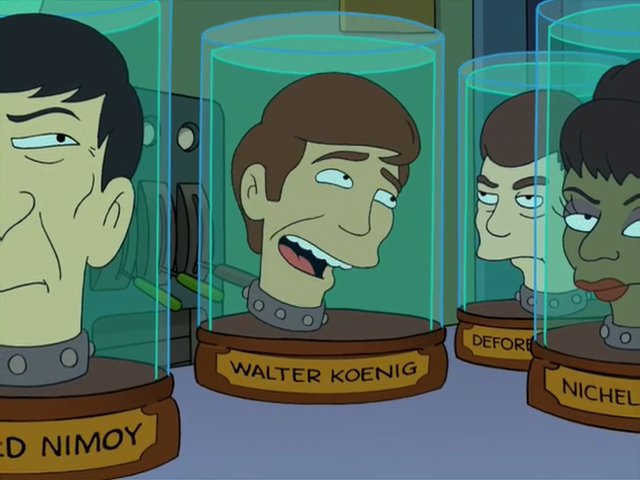

+++
title = "This Is OK"
date = "2025-07-30T20:45:07-04:00"

#
# description is optional
#
description = "Wherein the content is obviously not OK."

tags = ["education","meta","miscellany","zestiness",]
+++

Not everything has to be perfect.

There's a lot of times when I find myself thinking, "I should write something for Sad Spiders". Then I don't.

Life gets in the way.
The content sucks.
The content is stupid.
I can't possibly write 400+ words about *x*.

Well, today I break that cycle.

Because **this**. You're reading it.

It isn't AI generated.

### Deepness

So today I realized suddenly that I am no longer very punk rock. My very punk rock younger self would be pretty disappointed with me and that's OK. I'm no longer the punk rock little turd shit kid that I once was. No, I am now a grown-up. I still kind of want to get a skateboard just so I can finally learn to kickflip consistently, but otherwise I am now just some grown-up asshole who has a car and bills and keys and still uses Instagram technically (but in practice not so much).

> Not just an actor but a well-rounded person... with my own friends and credit cards and keys...

And that's OK.

I think I was punk rock to cover up for the 98% scared that I was at any given time. Maybe not scared, but almost certainly anxious.

Things change in life. Change is hard.

I'm scared less now. I don't need to be punk rock.

But if you're still punk rock, good for you I also eat a lot of beans and rice so we've got that in common.

### Good enough

There's a good video on youmtube about how the "word" OK/okay came to be.

OK?

Wait hold on