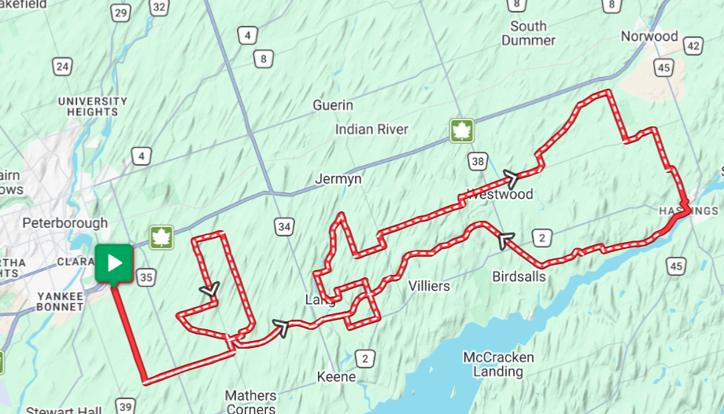
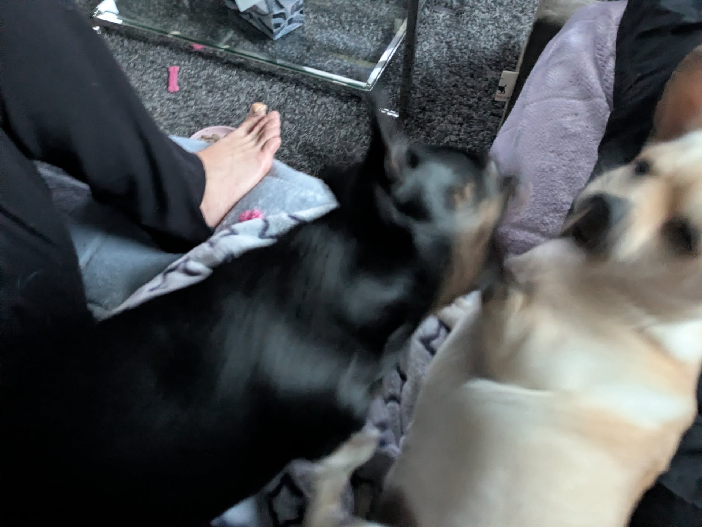
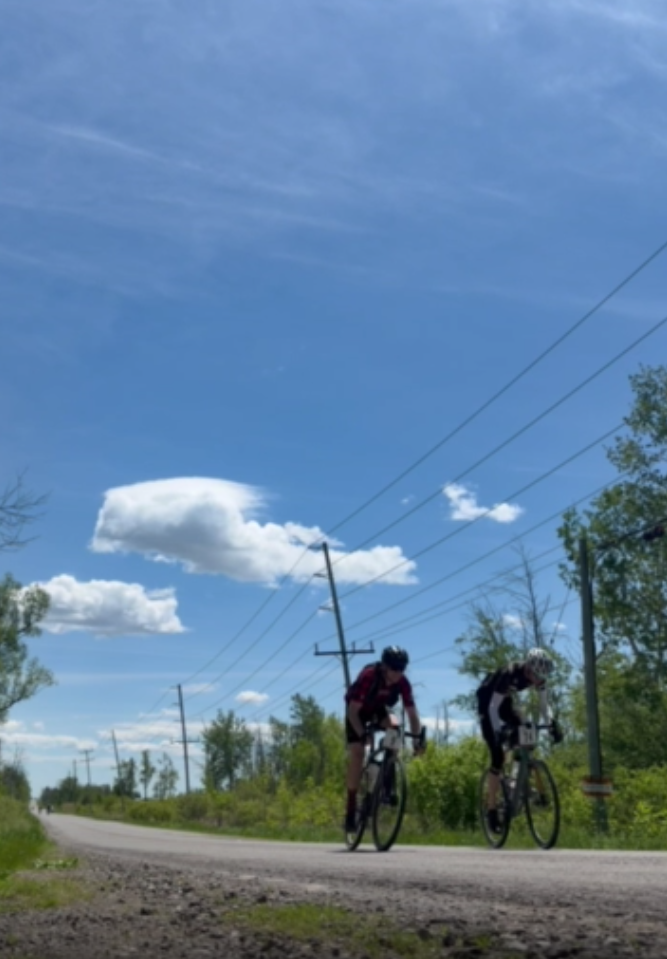

## A story with no stakes

I've never done a 100 km gravel race before. I've only ever done the Paris to Ancaster classic distance before, which clocks in at a whopping 67 km or something to that effect. So not only are we adding another half that distance again, but there are like 10% the number of people participating - the hardcorest.

Riding 100 km is not that exciting, in a sense. I've done it multiple times over the years, and during training for this race I did a 100 km training ride on rail trails in about 4 hours with lots left in the tank.

Racing 100 km across rolling hills is my idea of a good time. But for some reason, generalized anxiety doesn't give a shit about evidence. It cares about protecting me from whatever ephemeral, incoherent threat it has decided exists here. What joy it is.

> According to the map the course is only about 4 inches.

## OK so then what

Pack up car, drive to Peterborough, stay with sister. Nice to have a visit, meet her little family. Give some dogs some belly scratches, get asked to join one of their packs. Dogs are good dudes. Dudettes, I guess.

> There's way better pictures but I prefer the chaos

We have Unbound 200 on live the day before the race. If these guys can race 320km through mud and storms, I can do 100 km on dry roads with a gentle breeze. I check in with my AI coach - the likelihood that I will spontaneously die is very low. I know that AI can hallucinate but I agree with it in this case.

I will face my irrational fear, I will race my bike.

## K then it's race day

I had a good sleep before race day! I get up and slap on my tights and some sunscreen and head to the venue. I get signed in. I hang out, I stretch, I eat my pre-race banana. I ride down the road to warm up. I like warming up, it reassures me that my brain is just worried about the uncertainties of the next few hours and that those next few hours are just riding bikes.

I see some of the local GCC riders neat the start and stop by to say hello. They remember me from a ride a week ago, I have bike racer friends! We agree that we'll feel a lot better once we're moving. We wish each other luck, we head for the start. They line up ahead oh me - I know they are faster than me, also I hate being in groups of people.

We get our safety briefing, we make sure our bike computers are ready to go, we wait.

I've noticed that in the five minutes before we head out my right quad shakes. Nerves and adrenaline, but that's my tell. I tell myself that it's just my body getting ready to go. And when it's time to go, chaos reigns. Everyone's pent up energy just goes straight into their pedals.

The speed are well over 35 km/h for the first long while. The adrenaline hits its peak and my HR is uncomfortably high. My mouth goes dry. Part of me wants to freak out. The other part knows it for what it is - a wave of anxiety that will die down in time. I take a few sips from my water bottle and try to figure out if I should step on the gas and keep up with the groups ahead, or do I be sensible and let them go.

I keep on the gas. It's the wrong decision, and I know it. But races start out hectic and we'll settle in at some point and be reasonable. Luckily, soon enough we hit rail trail. Unlike the rolling hills of most of this course, rail trails are flat and they are straight. I settle in at the back of a row of about seven riders. I settle in and let them tow me along while I ease into a high tempo pace.

## settling in

Although it is long, this race is relatively *fast*. The top riders will maintain almost 40 km/h for the full distance. My goal is to maintain 30 km/h. The kilometers tick off fairly quickly.

At some point we blast down a sizeable hill and I see my GPS at like 61 km/h. At the bottom of the hill some poor rider is lying supine on the side of the road. Others have already stopped to help, so I go on. They assure us he is conscious and responsive but hurt. About 15 minutes further along a paramedic flies by in that direction with lights and sirens. I later here it is likely just a broken collarbone and I hope that's the case.

I was riding along with a group of about five riders for a while, all taking turns at the front to let the others have a break and keeping us all moving a bit quicker. We reach the largest climb on the course, and it seems like suddenly I am alone. I look back occasionally and there is a lone rider behind me for a while and I consider slowing to let them catch up, but at some point, they disappear as well.

On the one hand, I pat myself on the back. I am so fast! But the wind has also picked up and I am riding solo. For at least 15 minutes I see nobody ahead of me, nobody behind me. It's only been two weeks and I can't remember if someone caught me or if I caught them, so it must be that they caught me. Selective amnesia. A Colombian fellow. Not very chatty, but he was happy to take turns. Well, he was happy to take like half-turns. Not that I'm too concerned, it was better than no help. Eventually we caught another small group! We stuck to that group for a while.

Sometime after the mid-point of the race, my Colombian friend disappears off the back. There is one really strong rider in my current group and I think he must be towing along some friends since he occasionally drops back and offers advice or support before heading to the front of the group again. This is great for me - we had been chasing for a good long while so it's nice to recover even just a little bit and just sit on some wheels.

My fuelling was good for this race. I had my usual three bottles including the one big bottle, and I also brought along some boiled, salted potatoes. They aren't as sweet as candy so they might not scratch that "fuck I want candy" itch, but they kept me powered up over the duration.

## A tale of survival

This is where it gets interesting. We've been on rolling hills with a lot of difficult climbs and short interludes of recovery during descents. Then onto more rail trail. Our little group catches up to a second group! Nice, we've just moved up like 10 places in the overall! But.. ..actually no, it looks like my group is happy to just sit and draft off these guys. Of course, I'm "recovered" from sitting on wheels and need to fly.

So I pass the entire line of like 12 riders at this point and am curious if anyone will follow. They do. I go into the drops and just settle in at an unsustainable pace for a while. I get a tickle in my throat. Which is weird, but hey, that's what happened. I cough to try to get rid of it. No dice. Send some water in after it, some potato. Nothing. Still tickle. Still plowing along at a high pace at this point. I do one of those like "cough so hard you verge on gagging" coughs and suddenly my brain knows what is wrong - I'm having an exercise-induced asthma attack. I heard of a friend who had one once.

I feel that flare of fear. Through the elevated heart rate, the ongoing light burn in my quads, I decide I am about to spontaneously die. If that's the case, I figure I may as well die doing what I love. Also the more reasonable part of my brain tells me that no it's just a tickle and it should resolve soon - just let one of these other nerds pull for a while and have a bit of a chill.

So I do. The tickle resolves. I survive.

## Emptying the tank

I cruise with this group to the end of the rail trail. The rolling hills start all over again. There are probably like 20 km left of the race. I can do 20 km in my sleep. The group start to fragment because of the hills. I decide to make a break and see if I can pull anyone along to put in a bit of space in front of the group behind us and assure ourselves at least our current standing in the overall.

Two people come along for the ride. One really serious-looking dude wearing some plaid-looking kit, and a younger-looking woman. The plaid-guy takes charge and cheers us on that if we work together it will be more effective. So we take turns pulling. After a while it becomes obvious that our female companion is barely hanging on and not taking turns - but we're amateur athletes so we let her piggyback with us anyway.

Time passes, hills are climbed and descended, headwind is fought through. At some point we begin passing the 60 km distance riders. Plaid-guy has become know as Andrew and we chatter away as we count down the distance to the finish. At some point with not much distance left we drop our female groupmate. I later learn she was the top U19 female finisher and that's pretty awesome.

Andrew and I continue to take turns all the way to the finish line. Because he knows that he is a stronger cyclist than me he lets me win our "sprint" across the line.

> This is more in jest than a real sprint. Taken from a video so not top quality.

And that, children, is how I ended up in 73rdth place out of like 154 racers in the 2026 100 Acre Gravel 100 km race. It wasn't a total sufferfest - I was tired and it took some tenacity, but it's not like I maxed myself out for the last 25 km and crossed the finish line on the verge of unconsciousness. I'm happy with my performance. I finished, I finished strong and didn't leave a lot out on the course. Average 28.9 km/h in a time of 3h31m. Next year I'll be faster.

I begin to look forward to the next week's Screaming Squirrel 70 km race - should be a peach and cake!

## Some coincidence

After the race I was studying the results sheet. I knew that a friend's sister did the race as well so I looked up her time. When I did so, her team name caught my eye - isn't that the same jersey that Andrew was wearing? I go back to the mean's results - Andrew was indeed on the same team.

My interest is piqued - next week at Screaming Squirrel our friend's sister and brother-in-law are expected to be there. At some point our friend sent us a newspaper article about an achievement that the brother-in-law achieved so I dig up an email and click the link to that article where I see his name and photo.

My new friend Andrew from 100 Acre Gravel is the same dude that I expect to meet next weekend and race the Screaming Squirrel with. Weird.
