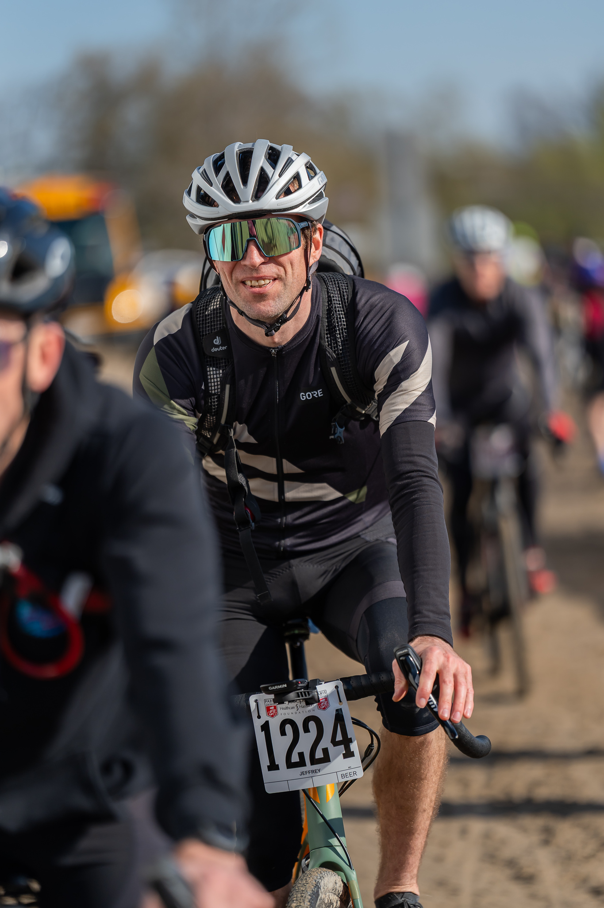
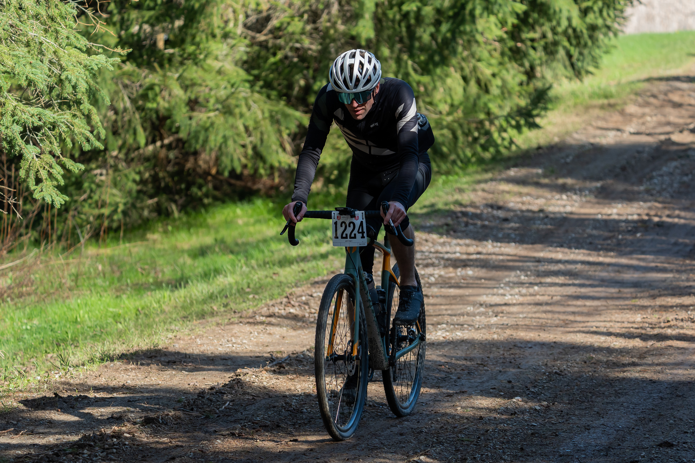
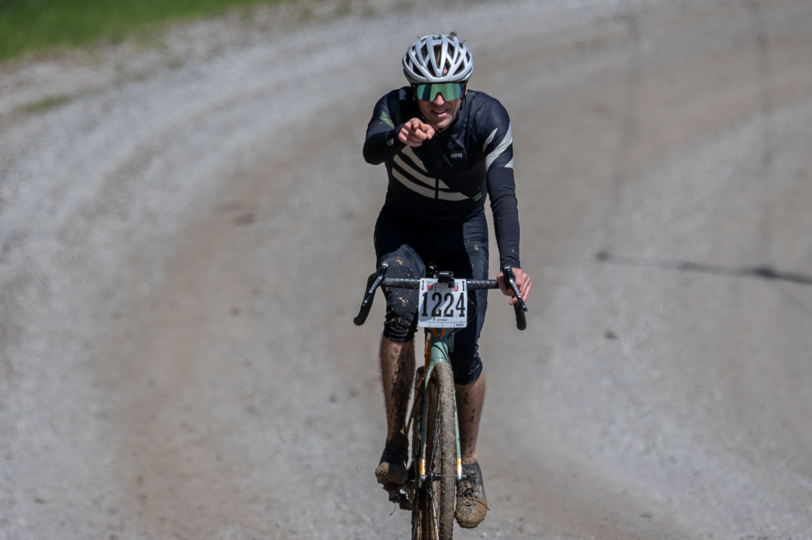
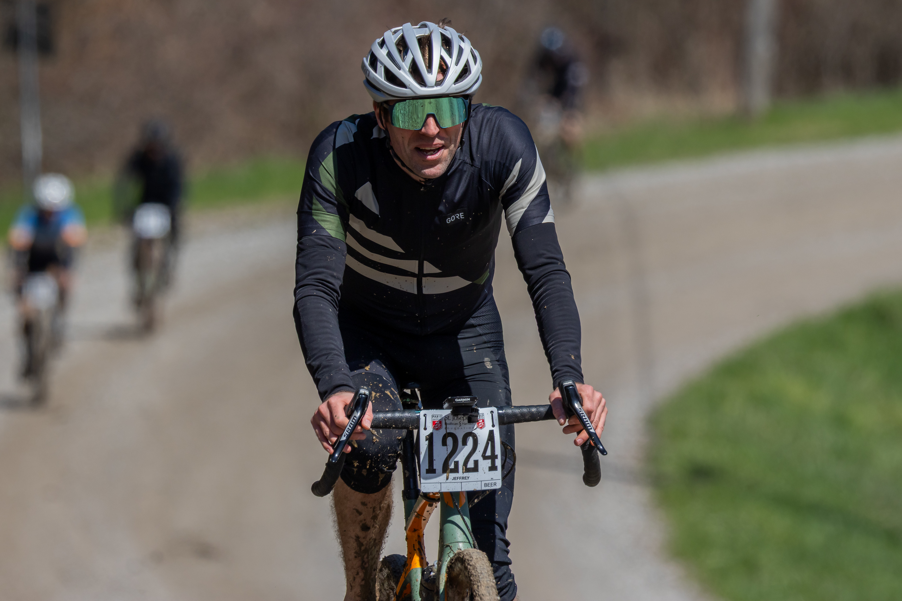

## Abstract

The Paris to Ancaster bicycle race took place on April 26, 2026. Our subject made a number of changes in the off-season which should have resulted in increased strength and fitness. Race day was a nice day following a snowy winter and wet spring which resulted in the wet and muddy sections being very wet and muddy. The pacing plan was carried out effectively but the subject was slower than last year's time by several minutes, resulting in cofusion on his part. The lower relative perceived exertion experienced during the race is an indicator of increased fitness.

> There is mention of AI in this article. It had no part in writing any of this. If it did, this would be a lot better, but also a lot more bland and none of us would be happy.

### Past P2A race reports

- [Paris to Ancaster 2024](/paris-ancaster-2024)
- [Paris to Ancaster 2025](/p2a-2025)

## Off-season training

Throughout the off-season I had myself parked on the trainer in front of [Zwift](https://zwift.com) a lot under the tutelage of an app called Xert. In the dead of winter I realized something was off. I was struggling to get through relatively easy workouts.

Around the same time I had been curious about what Anthropic's [Claude AI](https://claude.ai) was capable of. My bike fitter had mentioned that you could get a pretty good training plan from AI these days, so I gave it a go. And I cancelled Xert, which is apparently good at wearing people out. They would say I just wasn't experienced enough to use it and that's fine. Moving on.

Without getting into a lot of chaff, here's some of the changes that were made to my training after consulting with my new AI ~~overlord~~ coach:

- Periodize. Three hard weeks, followed by one recovery/consolidation week.
- Polarize. Easy days very easy, hard days so hard. Two hard days a week. Huh huh, hard. 
- Improved on-bike nutrition. Start taking in just a ton of sugar. Bought some fructose and maltodextrin from the local bulk food store, made 2:1 maltodextrin:fructose drink mix. 62g carbs per bottle. Plan to increase this over time.
- Improve off-bike nutrition. Athletes need more protein. Add greek yogurt, pumpkin seeds. Have some whey powder immediately after workouts. Chick peas!
- Hydration. Less beer, less Coke Zero (aka Diet Coke for Men). Not none, less. Lots of water. Yes, plain stupid water.
- Sleep. Recovery is the most crucial part of the process. Protect and prioritize sleep.

Doing easy days really easy was a challenge, as a friend once said "you're just training to go slow". Made easier with the trainer controlling my power output (ERG mode). But apparently it's creating a shit ton of good adaptations to more efficiently process oxygen and energy. And even though it is the bulk of riding time, it doesn't create a lot of fatigue that requires more recovery. The hard days were hard. There were multiple times when the legs just quit and the workout was abandoned. Tough to take, but you just try again next time.

When things didn't go to plan, like when work gets stressful, I could just work with Claude to adapt. Things generally went well, along with the regular ups and downs of life.

As race day approached, I never really got excited like I did the last couple of years. I had nobody to hang around with before the race. Even if not going head-to-head, it's more fun when you know someone who's going through it all as well. Bonding over shared ~~suffering~~ Type II fun. I'm carrying some grief and it was really digging it's little hooks into me. I dreaded it a bit.

My *modus operandi* lately has been just showing up. Be consistent. Trust the training. If you show up, you'll do okay. Maybe not great, maybe you'll give up. But at least you tried. Trying seems to be important.

## Taper week

The week before the race I let my foot off the gas to give the body a chance to fully recover before race day. Taper week effing sucks. I was lethargic. I was moody. I was tired. Along with not having a lot of excitement for the race - not a good scene. Apparently this is a normal phenomenon. I'm used waking up and knowing exactly what the plan is for today and then having some feedback from a workout. Not having those things threw me for a loop. I just anxioused.

The day before the race, I did a set of "openers": really easy ride with a few hard efforts in there to wake up the legs. I felt thoroughly *fine*. I'll get through the race. I just don't know how it will go. Trust the training.

## Race day

Race day dawns sunny and bright. In the immortal first words of the novel *1984*, "it was a bright, cold day in April...". I slept surprisingly well the night before. I bundled up every piece of bike-related kit that I own and head off to the start. Faff in the parking lot for an hour and chatted with my parking-neighbours. Friendly folk, good for race-day nerves.

I grab my finish-line backpack and drop it off to the designated truck, and do a bit of warming up before things get serious. I see nobody familiar during my travels.

Yes, I am sporting almost identical kit to last year.

Time winding down, I head to the start corral. I hate the feeling of being hemmed in somewhere, so I hang around at the back where I have a bit of room to breathe. Back of Wave 1 at least - the Fasties. The plan is to take it easy off the start, so being at the back works for me.

## Off we go

The starting muskets are fired, and we are released onto the 65.5 km kilometer course covered in tarmac, gravel and mud. A lot of people are heading out full effort. My plan is to go out easy, keep the heart rate under control so I've got lots left in the tank later on. I sit at the back of the pack and draft shamelessly. I've done this enough times now that I've got an idea of what the course is like. Before I know it we're 5% done and I'm barely out of breath. Gonna crush this one.

We make our way to the only real hill in the middle of the course where I am still planning on doing a maintained effort instead of full-blasting it like last year. I could full-blast it and it would be super-satisfying, but I don't. I be sensible. I crest the hill and settle back in.

You can see my third water bottle here. Good call.

## Cruise control but also wet and mud

For a lot of the race I am just leaving my brain and muscles in cruise control mode. I look around and enjoy the day. I say hello to the horses and cows we pass. My distractability remains intact.

There are a few very, very muddy sections. There is no choice but to really amp up the effort level during these sections - anything less will result in dabs or the dreaded hike-a-bike. I make it through most sections unscathed. Soaked and muddy, but unscathed.

Some highlights from the whole course:

- The first feed zone is in a local park. However, thanks to the wet spring, the park is more akin to a marsh than a nice place to have a picnic. I feel water covering my entire lower half, but no one has any intention of slowing down. Good stuff. Thanks to my Ass Saver fender I don't have to have wet-butt.
- Shortly past said feed zone there is a slick muddy bit. Road riders are really shitty at riding their bikes in this type of stuff. I see a woman have her bike slide out from under her on a hill and she somehow landed on the guy behind/beside her and barely hit the ground. He ended up sliding out with her.
- Immediately following that the guy directly in front of me decides that actually now is a good time to rub his body in the mud. Somehow I unclip a foot and am able to land it between himself and his bike. Give him the "all good?" and since it's a pretty wimpy crash he's fine. I'm somehow able to get between him and his bike and barely slowed down. MTB skills FTW.
- Towards the end of the course, there is a bit of a downhill into a 90-degree right turn on tarmac. Since I am a brilliant strategist I plan to go into the corner wide, cut the apex and exit wide. The guy in front of me decides that doing the whole thing tight is his plan, and his rear tire decides that it actually can't hold grip in those conditions and let go. Poor guy slides out at about 45km/h and skitters across the road in front of me. There are some marshalls right there and I look back and he gets up quickly so I feel okay about not stopping.
- At one point I was in a pack of about 15 people heading towards the mudslide section. I know that my handling skills are better than most of those around me so I make a quick push onto the singletrack and only have one person ahead of me. We hit the muddy, deep muddy and rooty section. The person in front of me immediately gets squirrelly and I get past them. I continue on down the mudslide, having to unclip and almost dab at one point, but I made it! No dabs, no hike-a-bike. Once I exit the section I start climbing a hill and look back and there is no one behind me for thirty seconds. I feel strong, I bike good.

The above photo is taken at around this point. Also this point is like 63km into the race, so I am somehow still enjoying myself. If you read back to my earlier race reports, at this point in those races I was on the verge of collapse. But not this year! This year I am in full control! There is lots left in the legs! I've barely gotten started!

## Upwards and also the finish line

So now there is only one challenge left - that big hill at the end. In years gone by, I remember thinking, "I've got no deeper left to dig". Not this year though. This year I have a gear left. I am going to crush the hill. I've been going slower than normal all race, I'm going to wind up and really give this thing the business.

For the third year in a row, I go too hard on a fake-hill near the finish. Ugh.

As I'm at the base of the really hill, I hear a spectator shout out about Grimey! My friend MM who has raced this in the past has offered to drive me back to the start line so I can get my car and head home. We share a quick word and I start racing him to the top of the hill. He is on foot and I am destroying! Also there are a lot of cyclists around me and I am passing a lot of them.

I watch the heart rate climb on my computer. 186 bpm I think we hit? At some point I had pushed too hard and had to back off, but still got to the finish feeling like I might throw up iminently.

And as in years gone by, it's done.

## Results and denouement

I feel good. Since I am in a data-driven state of mind, I label the race to have had a RPE of 7. This is.. ..pretty low. Given my newfound fitness and kickass pacing strategy, I feel good. After a minute to get my heart rate under control, I enjoy a sit-down and feel like I could keep going if necessary. At the very least, my hill time should be pretty kickass.

MM and I head back to the car and have a nice chat about bike racing, BMX racing and the overall good vibes of the community. I forget, I was tired. Nice chat though.

When I see the results sheet, I am a bit disappointed with my performance. The top finishers took right about the same amount of time as last year. So muddier, shorter course but less tailwind than last year even out. My time is a full five minutes slower than last year at just under 2h29m.

Insult was, proverbially, added to my injury. There is a note at the top of the result sheet:

> There is no hill time this year due to lack of cellular coverage.

I am now, unfortunately, somewhat deflated. Everything was fine, everything went to plan, everything is still a disappointment.

What the [expletive deleted] happened? I thought this pacing strategy was going to help me reach new heights?! I discuss with Claude. The short answer: I labelled this as a 'B' race this year. I marked the 100 Acre gravel race, coming up in a month, as an 'A' race. So Claude had kept me shy of going full blast on purpose. The advice if I hadn't labelled this a 'B' race: the last 20km just let rip. Would that have made up the difference?

It's done, it's a data point, it was a fun experience all said and done. I'm glad I'm planning on doing more races this year and seeing if that can get me more faster.

Maybe I've reached my peak. If that's happened, fair enough. But I probably haven't. Just need to keep showing up. There aren't any shortcuts. And a day on the bike is better than a day at work.

